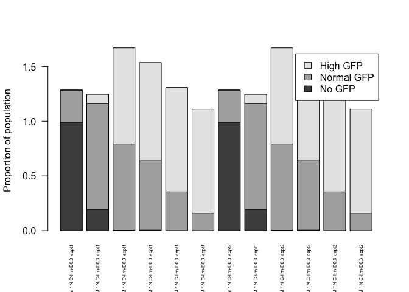
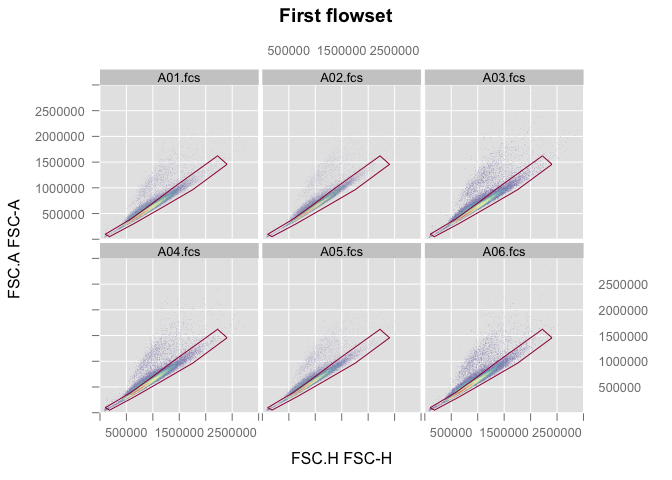

# Gresham Lab Flow Core Guide
`r Sys.info()[7]`  
`r Sys.Date()`  

> "I hear and I forget. I see and I remember. I copy this file and
>   modify it and I have a reproducible record of my analyses."
>
>   - Confucious

<!--
> "The people may be made to follow a path of action, but they 
>   may not be made to understand it."
> 
>   - Confucious
-->


**Experiment overview**

Write a detailed description of your experiment here including the goal of the analysis and your interpretation of the results.   
If you still see this text it means that you have not described the experiment and whatever follows is meaningless.
Life is meaningless - but properly documented experiments have context.

For example, this example without context makes me wonder why we're
looking for GFP fluoresence with a dye as the major source of 
variation in the experimental design. Is there a GFP as a 
transcription-and-translation reporter of dye content?

###############################

> This code is designed for use with the Accuri flow cytometer, which is equiped with the following lasers and filters

* Blue laser (488 nm)
  + FL1 filter = 514/20nm   GFP
  + FL3 filter = 575/25nm   YFP

* Yellow/green laser (552 nm)
  + FL2 filter = 610/20nm   mCherry, dtomato
  + FL4 filter = 586/15nm   DsRed
  
[You should be familiar with your flow cytometer](https://gencore.bio.nyu.edu/shared-equipment/flow-cytometry/)  

**Requirements**  
In order to run this code you need:  
  + to predefine your gates using the **gating.R** script  
  + the **gates.Rdata** workspace, which contains the gates used in this script  
  + the path of the directory(ies), given the variable names **dir1**, **dir2**... that contain .fcs files named A01.fcs, A02.fcs, A03.fcs...  
  + a tab delimited sample sheet in each directory with the following rows: <Well>	<Strain>	<Genotype>	<Ploidy>	<Media>	<Experiment>  
  + the variable names are changed in chunk 2 named "Variable Names"    


**Output**  
This script generates a summary of results followed by quality control plots.  

#Step 1: Load relevant libraries 

This is a function that just makes sure you have a package, or installs it for you without prompting

<!--
RStudio seems to have fucked up how they packaged `httpuv`, and 
didn't test a non-gui install, like they should. I'm not alone in 
this problem online,  and `httpuv`
doesn't install like an R package. I'm assuming they slip it into
RStudio, and then build dependencies upon it that won't install
unless you manually install it. So `flowWorkspace` won't load right.

You need to open up another session of R with `--no-init-file` and
`--no-restore` and install the packages.
-->


```r
source("src/requireInstall.R")
requireInstall("reshape2")
```

```
## [1] 1
```

```r
requireInstall("ggplot2")
```

```
## [1] 1
```

```r
requireInstall("flowCore",isBioconductor=T)
```

```
## [1] 1
```

```r
requireInstall("flowViz",isBioconductor=T)
```

```
## [1] 1
```

```r
requireInstall("Hmisc",isBioconductor=T)
```

```
## [1] 1
```

```r
requireInstall("gridExtra")
```

```
## [1] 1
```

```r
requireInstall("flowStats",isBioconductor=T)
```

```
## [1] 1
```

```r
requireInstall("flowWorkspace",isBioconductor=T)
```

```
## [1] 1
```

```r
requireInstall("ggcyto", isBioconductor=T)
```

```
## [1] 1
```
<!--
In the above chunk, we should specify the end packages and let them
handle dependencies as it sees fit.
-->

#Step 2: Read in .fcs files

Read in all data for analysis. Data should be in individual directories that contain .fcs files and a corresponding sample sheet with a generic format. 
FCS file names need to match the `SampleSheet.txt`.

Want to make your `SampleSheet.txt`? Use a GUI spreadsheet thingy,
like excel or googledocs or localc or `edit()` in R.
The format is:

| FileName | Ploidy | Dye | ... |
|:---|:---|:---|:---|
|A01.fcs|1.5ploid|acridineOrange|...|
|A02|2.5ploid|acridineOrange|...|
|A03.fcs|1.5ploid|sytoselect|...|

Where the only mandatory variable name is `FileName`, then all
the others are whatever you're using.

An abitrary number of directories can be used, put the paths in the
`dataDirectoryz` vector. Here we use relative becuase it should be
reproducible between users. You should use ABSOLUTE for your real
work. Don't have this folder? Download it (look up).


```r
dataDirectoryz <- c("exampleFlowDataset1")

rm(oneBigFlowSet)
for (dataDirectory in dataDirectoryz) {

  print(paste("Reading",dataDirectory))

  tmpSampleSheet <- read.delim(
    paste0(dataDirectory,"/SampleSheet.txt"),row.names=1)

  tmpFlowSet <- read.flowSet(path=dataDirectory,pattern=".fcs",
    alter.names=TRUE, #why?
    phenoData=new("AnnotatedDataFrame",data=tmpSampleSheet)) 

  sampleNames(tmpFlowSet) <- paste0(dataDirectory,"/",
    sampleNames(tmpFlowSet))
  pData(tmpFlowSet)$name <- sampleNames(tmpFlowSet)

  if (exists("oneBigFlowSet")) {
    oneBigFlowSet <- rbind2(oneBigFlowSet,tmpFlowSet)
  } else {
    oneBigFlowSet <- tmpFlowSet
  }
}
```

```
## [1] "Reading exampleFlowDataset1"
```

```r
pData(oneBigFlowSet)
```

```
##                             Strain ul500nMDye Ploidy      Media Expierment
## exampleFlowDataset1/A01.fcs   DGY1          0     1N C-lim-D0.3      expt1
## exampleFlowDataset1/A02.fcs   DGY1         10     1N C-lim-D0.3      expt1
## exampleFlowDataset1/A03.fcs   DGY1         50     1N C-lim-D0.3      expt1
## exampleFlowDataset1/A04.fcs   DGY1        100     1N C-lim-D0.3      expt1
## exampleFlowDataset1/A05.fcs   DGY1        250     1N C-lim-D0.3      expt1
## exampleFlowDataset1/A06.fcs   DGY1        500     1N C-lim-D0.3      expt1
##                                                    name
## exampleFlowDataset1/A01.fcs exampleFlowDataset1/A01.fcs
## exampleFlowDataset1/A02.fcs exampleFlowDataset1/A02.fcs
## exampleFlowDataset1/A03.fcs exampleFlowDataset1/A03.fcs
## exampleFlowDataset1/A04.fcs exampleFlowDataset1/A04.fcs
## exampleFlowDataset1/A05.fcs exampleFlowDataset1/A05.fcs
## exampleFlowDataset1/A06.fcs exampleFlowDataset1/A06.fcs
```

```r
print("Counted this many events:")
```

```
## [1] "Counted this many events:"
```

```r
print(fsApply(oneBigFlowSet,nrow))
```

```
##                              [,1]
## exampleFlowDataset1/A01.fcs 50000
## exampleFlowDataset1/A02.fcs 50000
## exampleFlowDataset1/A03.fcs 50000
## exampleFlowDataset1/A04.fcs 50000
## exampleFlowDataset1/A05.fcs 50000
## exampleFlowDataset1/A06.fcs 50000
```

```r
print("other statz?")
```

```
## [1] "other statz?"
```

```r
print(fsApply(oneBigFlowSet,each_col,median))
```

```
##                                FSC.A   SSC.A   FL1.A FL2.A FL3.A FL4.A
## exampleFlowDataset1/A01.fcs 562697.0 77701.0  2566.0   276   756   251
## exampleFlowDataset1/A02.fcs 637355.5 90199.5  9941.0   558  2242   493
## exampleFlowDataset1/A03.fcs 579237.0 79793.0 19631.0  1146  4984  1002
## exampleFlowDataset1/A04.fcs 546466.0 80743.0 20697.5  1267  5452  1090
## exampleFlowDataset1/A05.fcs 552799.5 81623.0 25457.0  1641  7192  1423
## exampleFlowDataset1/A06.fcs 524191.5 78656.0 28496.5  1862  8128  1614
##                                FSC.H    SSC.H   FL1.H FL2.H FL3.H FL4.H
## exampleFlowDataset1/A01.fcs 871409.5 108347.0  2846.0   185  1594   421
## exampleFlowDataset1/A02.fcs 969225.0 122714.5  9728.0   419  2453   568
## exampleFlowDataset1/A03.fcs 898238.0 110155.0 18645.0   953  4677   959
## exampleFlowDataset1/A04.fcs 852802.0 113254.0 19810.0  1077  5120  1042
## exampleFlowDataset1/A05.fcs 859692.0 114994.5 24078.0  1412  6609  1328
## exampleFlowDataset1/A06.fcs 820285.5 111785.0 27025.5  1616  7456  1508
##                             Width Time
## exampleFlowDataset1/A01.fcs    58  184
## exampleFlowDataset1/A02.fcs    60  184
## exampleFlowDataset1/A03.fcs    58  188
## exampleFlowDataset1/A04.fcs    57  184
## exampleFlowDataset1/A05.fcs    58  186
## exampleFlowDataset1/A06.fcs    57  188
```

Now you have `oneBigFlowSet`. Great. For gating, we'll turn that into
a data.frame:


```r
source("src/fs2df.R")
datar <- fs2df(oneBigFlowSet)
save(file=paste0("flowSet",digest::digest(oneBigFlowSet),".RData"))
```

```
## Warning in save(file = paste0("flowSet", digest::digest(oneBigFlowSet), :
## nothing specified to be save()d
```


#Step 3: gate

So I can't actually figure out how to make rmarkdown play with
interactive chunks. So you should see an error right about....


```r
gateFilename <- paste0("gatesFor",digest::digest(oneBigFlowSet),".RData")
load(gateFilename)
```

Okay, so now go to your terminal and run this:


```r
source("src/gator.R")
gatez <- list()
gatez[["singlet"]] <- gator2d(datar,ehx="FSC.A",why="FSC.H",
  gateName="singlet") 
gatez[["cells"]] <- gator2d(datar,ehx="FSC.A",why="SSC.A", 
  gateName="cells") 
gatez[["gfpPos"]] <- gator2d(datar,ehx="FSC.A",why="FL1.A",
  gateName="gfpPositive") 
gatez[["gfpNeg"]] <- gator2d(datar,ehx="FSC.A",why="FL1.A", 
  gateName="gfpDepressing") 
save(file=gateFilename,list=c("gatez"))
```

If you screw it up, delete the RData file of the gates, and re-run.

<!--
This also needs an implementation for 1D. I'm thinking that you just
call `gator` function, then you give it a vector of one or two
dimensions you want to gate on. Then you give it a vector of one or
two dimensions to plot. It builds the plot, then the current 
implementation would be if you give it two and two. If you give it
one and one, then it's gating on a histogram with locate(1).
If it's two plot and one gate, then it's a one sided gate on a 2d
scatter. Would be cool.

Would be nice to also have a quadrant gate. Are there functions in
flowCore for this?
-->

how they look?


```r
#source("src/gateCheck.R")
#gateCheck()
#make a function so we can re-call it after starting to apply these
for (gateName in names(gatez)) {
  print(gateName)
  ingate  <- data.frame(
    fs2df(Subset(oneBigFlowSet,gatez[[gateName]])),thisGate=T)
  outgate <- data.frame(
    fs2df(Subset(oneBigFlowSet,!gatez[[gateName]])),thisGate=F)
  shuffle <- rbind(ingate,outgate)
  shuffle <- shuffle[sample(1:nrow(shuffle)),]
  names(shuffle)[which(names(shuffle)=="thisGate")] <- gateName
  print(
    ggplot(shuffle)+
      facet_wrap(~name)+
      aes_string(x=colnames(gatez[[gateName]]@boundaries)[1],
                 y=colnames(gatez[[gateName]]@boundaries)[2],
                 col=gateName)+
      geom_point(size=0.2,alpha=0.5)+
      scale_y_log10()+
      scale_x_log10()
  )
}
```

```
## [1] "singlet"
```

<!-- -->

```
## [1] "cells"
```

<!-- -->

```
## [1] "gfpPos"
```

<!-- -->

```
## [1] "gfpNeg"
```

<!-- -->
Subset the data by applying sequential gates


```r
rm(filteredDatar)
for (gateName in c("singlet","cells")) {
  print(gateName)
  if (exists("filteredDatar")) {
    filteredDatar  <- Subset(filteredDatar,gatez[[gateName]])
  } else {
    filteredDatar  <- Subset(oneBigFlowSet,gatez[[gateName]])
  }
}
```

```
## [1] "singlet"
## [1] "cells"
```

```r
#gateCheck() call would go here
```

Buidling a better datastructure, for later use


```r
source("src/splitFSbyGate.R")
gatedFilteredDatar <- filteredDatar
for (gateName in setdiff(names(gatez),c("singlet","cells"))) {
  gatedFilteredDatar <- splitFSbyGate(gatedFilteredDatar,
    gatez[[gateName]])
}
```

```
## [1] "applying gate gfpPos"
## [1] "applying gate gfpNeg"
```

```r
gfdatar <- fs2df(gatedFilteredDatar)
```

#Step 4: Plotz

Into usable form:


```r
head(gfdatar)
```

```
##   Strain ul500nMDye Ploidy      Media Expierment
## 1   DGY1          0     1N C-lim-D0.3      expt1
## 2   DGY1          0     1N C-lim-D0.3      expt1
## 3   DGY1          0     1N C-lim-D0.3      expt1
## 4   DGY1          0     1N C-lim-D0.3      expt1
## 5   DGY1          0     1N C-lim-D0.3      expt1
## 6   DGY1          0     1N C-lim-D0.3      expt1
##                          name gfpPos gfpNeg  FSC.A  SSC.A FL1.A FL2.A
## 1 exampleFlowDataset1/A01.fcs  FALSE   TRUE 652669 144896  2548   397
## 2 exampleFlowDataset1/A01.fcs  FALSE   TRUE 710736  56184  1846    91
## 3 exampleFlowDataset1/A01.fcs  FALSE   TRUE 373277  23843  1543   188
## 4 exampleFlowDataset1/A01.fcs  FALSE   TRUE 448538  71085  1581   278
## 5 exampleFlowDataset1/A01.fcs  FALSE   TRUE 500382 105385  2809   219
## 6 exampleFlowDataset1/A01.fcs  FALSE   TRUE 888546 138845  6934   444
##   FL3.A FL4.A   FSC.H  SSC.H FL1.H FL2.H FL3.H FL4.H Width Time
## 1  2244     0  887408 179410  2551   205  2277   431    64  140
## 2  1655   345 1208942  82023  2788   115  2127   359    56  140
## 3  2505     0  634903  43165  1842   106  1464    42    51  140
## 4   510   532  739700 101710  2436   137  1966   443    52  140
## 5  1015   283  834475 149330  1872   329  2045   502    54  140
## 6  1434   729 1396656 187847  6291   242  1179   620    63  140
```

```r
mfdatar <- melt(gfdatar,
  id.vars=c("Strain","ul500nMDye","Ploidy","Media","name","gfpPos","gfpNeg"),
  measure.vars=c("FSC.A","FSC.H","FL1.A","FL1.H","FL2.A","FL2.H"))
head(mfdatar)
```

```
##   Strain ul500nMDye Ploidy      Media                        name gfpPos
## 1   DGY1          0     1N C-lim-D0.3 exampleFlowDataset1/A01.fcs  FALSE
## 2   DGY1          0     1N C-lim-D0.3 exampleFlowDataset1/A01.fcs  FALSE
## 3   DGY1          0     1N C-lim-D0.3 exampleFlowDataset1/A01.fcs  FALSE
## 4   DGY1          0     1N C-lim-D0.3 exampleFlowDataset1/A01.fcs  FALSE
## 5   DGY1          0     1N C-lim-D0.3 exampleFlowDataset1/A01.fcs  FALSE
## 6   DGY1          0     1N C-lim-D0.3 exampleFlowDataset1/A01.fcs  FALSE
##   gfpNeg variable  value
## 1   TRUE    FSC.A 652669
## 2   TRUE    FSC.A 710736
## 3   TRUE    FSC.A 373277
## 4   TRUE    FSC.A 448538
## 5   TRUE    FSC.A 500382
## 6   TRUE    FSC.A 888546
```

- summary statistics


```r
fsApply(filteredDatar,function(x){
  data.frame(t(each_col(x,summary)))})
```

```
## $`exampleFlowDataset1/A01.fcs`
##         Min. X1st.Qu. Median      Mean X3rd.Qu.    Max.
## FSC.A 191500   448100 554900 584700.00   689200 1970000
## SSC.A  14300    57180  76160  82270.00   102200  437700
## FL1.A      0     1558   2515   2650.00     3591   13840
## FL2.A      0      107    274    293.40      446    1451
## FL3.A      0        0    741    947.80     1565    6174
## FL4.A      0        0    249    313.10      510    2316
## FSC.H 329200   712500 867800 910000.00  1060000 2751000
## SSC.H  19210    81290 107100 113600.00   139600  564100
## FL1.H      0     2014   2815   2989.00     3780   15090
## FL2.H      0      116    184    189.30      257     914
## FL3.H      0     1156   1582   1620.00     2043    5759
## FL4.H      0      279    418    436.00      572    2196
## Width     39       54     58     57.73       62     104
## Time     140      162    184    184.20      206     228
## 
## $`exampleFlowDataset1/A02.fcs`
##         Min. X1st.Qu. Median      Mean X3rd.Qu.    Max.
## FSC.A 191400   507700 627700 6.558e+05   773100 1978000
## SSC.A  17230    66730  88050 9.472e+04   116400  878000
## FL1.A      0     7298   9721 1.424e+04    12470 2768000
## FL2.A      0      349    546 7.294e+02      754  171800
## FL3.A      0     1253   2184 3.105e+03     3174  840300
## FL4.A      0      201    481 6.521e+02      777  138800
## FSC.H 306000   798000 965000 1.005e+06  1171000 2740000
## SSC.H  20830    92960 120800 1.279e+05   155300 1169000
## FL1.H    133     7379   9601 1.397e+04    12120 2750000
## FL2.H      0      301    413 5.952e+02      538  167400
## FL3.H      0     1852   2423 3.338e+03     3104  824200
## FL4.H      0      396    560 7.205e+02      758  134200
## Width     41       55     59 5.942e+01       63      99
## Time     141      162    184 1.841e+02      206     228
## 
## $`exampleFlowDataset1/A03.fcs`
##         Min. X1st.Qu. Median      Mean X3rd.Qu.    Max.
## FSC.A 187900   461300 571600 600800.00   706400 1997000
## SSC.A  13150    58260  78300  84360.00   104500  424900
## FL1.A      0    14800  19290  40790.00    24730 3961000
## FL2.A      0      835   1125   2184.00     1473  221000
## FL3.A      0     3514   4889   9795.00     6465 1046000
## FL4.A      0      626    979   1827.00     1380  169600
## FSC.H 336400   735600 894100 937600.00  1091000 2726000
## SSC.H  18470    81870 108900 115100.00   141100  583600
## FL1.H    663    14520  18450  39060.00    23020 3602000
## FL2.H      0      725    943   1963.00     1197  210500
## FL3.H     14     3564   4628   9370.00     5870  993300
## FL4.H      0      690    948   1783.00     1266  161800
## Width     38       54     58     58.31       62     148
## Time     142      166    188    188.30      210     233
## 
## $`exampleFlowDataset1/A04.fcs`
##         Min. X1st.Qu. Median      Mean X3rd.Qu.    Max.
## FSC.A 181300   433300 540400 571100.00   674200 1886000
## SSC.A  15460    58560  79320  85430.00   106500  492200
## FL1.A      0    15400  20340  43920.00    26300 4209000
## FL2.A      0      920   1247   2510.00     1629  250000
## FL3.A      0     3840   5352  11020.00     7099 1136000
## FL4.A      0      694   1068   2070.00     1490  227800
## FSC.H 312000   698200 850200 896200.00  1045000 2729000
## SSC.H  21440    84240 112000 118400.00   145600  644100
## FL1.H    256    15230  19650  42720.00    24620 4028000
## FL2.H      0      805   1067   2303.00     1362  241100
## FL3.H      0     3836   5074  10640.00     6454 1093000
## FL4.H      0      744   1029   2030.00     1379  178700
## Width     39       53     57     57.06       61     108
## Time     139      162    184    184.10      206     228
## 
## $`exampleFlowDataset1/A05.fcs`
##         Min. X1st.Qu. Median      Mean X3rd.Qu.    Max.
## FSC.A 187000   440100 546400 576500.00   679300 1972000
## SSC.A  13080    59060  79970  86540.00   108300 1244000
## FL1.A      0    19460  25050  56080.00    32020 4112000
## FL2.A      0     1233   1614   3440.00     2078  504900
## FL3.A      0     5302   7073  15020.00     9143 1072000
## FL4.A      0      973   1396   2840.00     1878  692000
## FSC.H 301400   705300 857000 901400.00  1048000 2761000
## SSC.H  22410    85140 113500 120400.00   148700 1473000
## FL1.H    536    18990  23890  54100.00    29460 3982000
## FL2.H      1     1092   1399   3169.00     1743  330500
## FL3.H    564     5128   6555  14330.00     8172 1074000
## FL4.H      0      982   1315   2728.00     1715  448200
## Width     39       53     58     57.87       62     114
## Time     140      163    186    186.00      209     232
## 
## $`exampleFlowDataset1/A06.fcs`
##         Min. X1st.Qu. Median      Mean X3rd.Qu.    Max.
## FSC.A 190300   416600 518400 549300.00   648300 1846000
## SSC.A  11790    56870  77210  83960.00   105100  480000
## FL1.A      0    21810  28080  63780.00    35890 4795000
## FL2.A      0     1414   1832   4175.00     2351 1090000
## FL3.A      0     6057   7995  17880.00    10320 1276000
## FL4.A      0     1131   1585   3463.00     2110 1467000
## FSC.H 314200   670200 817000 862600.00  1006000 2562000
## SSC.H  19420    83320 110600 117700.00   145200  689100
## FL1.H     68    21420  26780  61580.00    32970 4422000
## FL2.H      0     1260   1600   3849.00     1997  586900
## FL3.H      0     5810   7391  16980.00     9222 1257000
## FL4.H      0     1115   1493   3280.00     1933  782200
## Width     40       52     56     56.47       60     114
## Time     142      165    188    188.00      211     234
```

```r
fsApply(gatedFilteredDatar,function(x){
  data.frame(t(each_col(x,summary)))})
```

```
## $`exampleFlowDataset1/A01.fcs_in_gfpPos_in_gfpNeg`
##       Min. X1st.Qu. Median Mean X3rd.Qu. Max.
## FSC.A   NA       NA     NA  NaN       NA   NA
## SSC.A   NA       NA     NA  NaN       NA   NA
## FL1.A   NA       NA     NA  NaN       NA   NA
## FL2.A   NA       NA     NA  NaN       NA   NA
## FL3.A   NA       NA     NA  NaN       NA   NA
## FL4.A   NA       NA     NA  NaN       NA   NA
## FSC.H   NA       NA     NA  NaN       NA   NA
## SSC.H   NA       NA     NA  NaN       NA   NA
## FL1.H   NA       NA     NA  NaN       NA   NA
## FL2.H   NA       NA     NA  NaN       NA   NA
## FL3.H   NA       NA     NA  NaN       NA   NA
## FL4.H   NA       NA     NA  NaN       NA   NA
## Width   NA       NA     NA  NaN       NA   NA
## Time    NA       NA     NA  NaN       NA   NA
## 
## $`exampleFlowDataset1/A02.fcs_in_gfpPos_in_gfpNeg`
##       Min. X1st.Qu. Median Mean X3rd.Qu. Max.
## FSC.A   NA       NA     NA  NaN       NA   NA
## SSC.A   NA       NA     NA  NaN       NA   NA
## FL1.A   NA       NA     NA  NaN       NA   NA
## FL2.A   NA       NA     NA  NaN       NA   NA
## FL3.A   NA       NA     NA  NaN       NA   NA
## FL4.A   NA       NA     NA  NaN       NA   NA
## FSC.H   NA       NA     NA  NaN       NA   NA
## SSC.H   NA       NA     NA  NaN       NA   NA
## FL1.H   NA       NA     NA  NaN       NA   NA
## FL2.H   NA       NA     NA  NaN       NA   NA
## FL3.H   NA       NA     NA  NaN       NA   NA
## FL4.H   NA       NA     NA  NaN       NA   NA
## Width   NA       NA     NA  NaN       NA   NA
## Time    NA       NA     NA  NaN       NA   NA
## 
## $`exampleFlowDataset1/A03.fcs_in_gfpPos_in_gfpNeg`
##       Min. X1st.Qu. Median Mean X3rd.Qu. Max.
## FSC.A   NA       NA     NA  NaN       NA   NA
## SSC.A   NA       NA     NA  NaN       NA   NA
## FL1.A   NA       NA     NA  NaN       NA   NA
## FL2.A   NA       NA     NA  NaN       NA   NA
## FL3.A   NA       NA     NA  NaN       NA   NA
## FL4.A   NA       NA     NA  NaN       NA   NA
## FSC.H   NA       NA     NA  NaN       NA   NA
## SSC.H   NA       NA     NA  NaN       NA   NA
## FL1.H   NA       NA     NA  NaN       NA   NA
## FL2.H   NA       NA     NA  NaN       NA   NA
## FL3.H   NA       NA     NA  NaN       NA   NA
## FL4.H   NA       NA     NA  NaN       NA   NA
## Width   NA       NA     NA  NaN       NA   NA
## Time    NA       NA     NA  NaN       NA   NA
## 
## $`exampleFlowDataset1/A04.fcs_in_gfpPos_in_gfpNeg`
##       Min. X1st.Qu. Median Mean X3rd.Qu. Max.
## FSC.A   NA       NA     NA  NaN       NA   NA
## SSC.A   NA       NA     NA  NaN       NA   NA
## FL1.A   NA       NA     NA  NaN       NA   NA
## FL2.A   NA       NA     NA  NaN       NA   NA
## FL3.A   NA       NA     NA  NaN       NA   NA
## FL4.A   NA       NA     NA  NaN       NA   NA
## FSC.H   NA       NA     NA  NaN       NA   NA
## SSC.H   NA       NA     NA  NaN       NA   NA
## FL1.H   NA       NA     NA  NaN       NA   NA
## FL2.H   NA       NA     NA  NaN       NA   NA
## FL3.H   NA       NA     NA  NaN       NA   NA
## FL4.H   NA       NA     NA  NaN       NA   NA
## Width   NA       NA     NA  NaN       NA   NA
## Time    NA       NA     NA  NaN       NA   NA
## 
## $`exampleFlowDataset1/A05.fcs_in_gfpPos_in_gfpNeg`
##       Min. X1st.Qu. Median Mean X3rd.Qu. Max.
## FSC.A   NA       NA     NA  NaN       NA   NA
## SSC.A   NA       NA     NA  NaN       NA   NA
## FL1.A   NA       NA     NA  NaN       NA   NA
## FL2.A   NA       NA     NA  NaN       NA   NA
## FL3.A   NA       NA     NA  NaN       NA   NA
## FL4.A   NA       NA     NA  NaN       NA   NA
## FSC.H   NA       NA     NA  NaN       NA   NA
## SSC.H   NA       NA     NA  NaN       NA   NA
## FL1.H   NA       NA     NA  NaN       NA   NA
## FL2.H   NA       NA     NA  NaN       NA   NA
## FL3.H   NA       NA     NA  NaN       NA   NA
## FL4.H   NA       NA     NA  NaN       NA   NA
## Width   NA       NA     NA  NaN       NA   NA
## Time    NA       NA     NA  NaN       NA   NA
## 
## $`exampleFlowDataset1/A06.fcs_in_gfpPos_in_gfpNeg`
##       Min. X1st.Qu. Median Mean X3rd.Qu. Max.
## FSC.A   NA       NA     NA  NaN       NA   NA
## SSC.A   NA       NA     NA  NaN       NA   NA
## FL1.A   NA       NA     NA  NaN       NA   NA
## FL2.A   NA       NA     NA  NaN       NA   NA
## FL3.A   NA       NA     NA  NaN       NA   NA
## FL4.A   NA       NA     NA  NaN       NA   NA
## FSC.H   NA       NA     NA  NaN       NA   NA
## SSC.H   NA       NA     NA  NaN       NA   NA
## FL1.H   NA       NA     NA  NaN       NA   NA
## FL2.H   NA       NA     NA  NaN       NA   NA
## FL3.H   NA       NA     NA  NaN       NA   NA
## FL4.H   NA       NA     NA  NaN       NA   NA
## Width   NA       NA     NA  NaN       NA   NA
## Time    NA       NA     NA  NaN       NA   NA
## 
## $`exampleFlowDataset1/A01.fcs_out_gfpPos_in_gfpNeg`
##         Min. X1st.Qu. Median      Mean X3rd.Qu.    Max.
## FSC.A 218200   454400 560900 591000.00   695100 1970000
## SSC.A  14300    58210  77560  83500.00   103600  437700
## FL1.A     76     1726   2621   2796.00     3665   13840
## FL2.A      0      110    276    296.20      450    1451
## FL3.A      0        0    753    957.40     1578    6174
## FL4.A      0        0    252    315.60      513    2316
## FSC.H 376700   720000 874900 918200.00  1068000 2751000
## SSC.H  19920    82760 108800 115200.00   141300  564100
## FL1.H    317     2130   2906   3091.00     3851   15090
## FL2.H      0      118    186    191.20      259     914
## FL3.H      0     1163   1588   1627.00     2049    5759
## FL4.H      0      281    420    438.10      574    2196
## Width     42       54     58     57.95       62     104
## Time     140      163    184    184.20      206     228
## 
## $`exampleFlowDataset1/A02.fcs_out_gfpPos_in_gfpNeg`
##         Min. X1st.Qu. Median      Mean X3rd.Qu.    Max.
## FSC.A 210800   509500 628800 6.578e+05   774600 1978000
## SSC.A  17230    67360  88520 9.522e+04   116900  878000
## FL1.A     89     7291   9673 1.027e+04    12350  166900
## FL2.A      0      346    543 5.658e+02      746  109800
## FL3.A      0     1242   2166 2.279e+03     3134   85990
## FL4.A      0      198    475 5.193e+02      764  106600
## FSC.H 306000   800100 966700 1.007e+06  1173000 2740000
## SSC.H  22710    93820 121400 1.285e+05   155800 1169000
## FL1.H    712     7369   9562 1.010e+04    12020  171600
## FL2.H      0      301    411 4.358e+02      533   91340
## FL3.H      0     1847   2409 2.536e+03     3075   75190
## FL4.H      0      394    557 5.926e+02      748   90590
## Width     44       56     59 5.948e+01       63      99
## Time     141      162    184 1.841e+02      206     228
## 
## $`exampleFlowDataset1/A03.fcs_out_gfpPos_in_gfpNeg`
##         Min. X1st.Qu. Median      Mean X3rd.Qu.    Max.
## FSC.A 276100   471200 578400 610100.00   712400 1979000
## SSC.A  13860    59660  79560  85550.00   105600  424900
## FL1.A    302    14960  19300  20420.00    24470  197300
## FL2.A      0      842   1124   1181.00     1458   12160
## FL3.A      0     3542   4883   5112.00     6394   38180
## FL4.A      0      629    976   1023.00     1361    8248
## FSC.H 343000   749400 904300 951000.00  1099000 2726000
## SSC.H  21180    83730 110500 116600.00   142300  583600
## FL1.H    927    14660  18460  19240.00    22810  199400
## FL2.H      0      731    943    987.60     1186   10080
## FL3.H     14     3581   4622   4818.00     5805   38990
## FL4.H      0      692    944   1003.00     1250    7637
## Width     42       54     58     58.63       62     148
## Time     142      166    189    188.40      211     233
## 
## $`exampleFlowDataset1/A04.fcs_out_gfpPos_in_gfpNeg`
##         Min. X1st.Qu. Median      Mean X3rd.Qu.    Max.
## FSC.A 272800   455200 556300 590600.00   687500 1886000
## SSC.A  15460    61180  81780  87700.00   108700  492200
## FL1.A    923    15840  20620  21690.00    26210  130300
## FL2.A      0      940   1261   1322.00     1625  190700
## FL3.A      0     3930   5412   5652.00     7076  139300
## FL4.A      0      705   1075   1134.00     1483  227800
## FSC.H 447000   729800 873300 924100.00  1064000 2729000
## SSC.H  23470    87390 115100 121100.00   148100  644100
## FL1.H   1273    15590  19860  20570.00    24580  115700
## FL2.H      0      822   1078   1122.00     1360  115000
## FL3.H      0     3903   5119   5290.00     6438   92520
## FL4.H      0      752   1035   1102.00     1373  134900
## Width     43       54     57     57.73       61     108
## Time     139      163    185    184.80      207     228
## 
## $`exampleFlowDataset1/A05.fcs_out_gfpPos_in_gfpNeg`
##         Min. X1st.Qu. Median      Mean X3rd.Qu.    Max.
## FSC.A 253200   466400 565400 599600.00   695900 1972000
## SSC.A  13080    61600  82520  88830.00   110500 1244000
## FL1.A    139    20090  25390  26810.00    31870  122700
## FL2.A      0     1267   1636   1743.00     2073  504900
## FL3.A      0     5460   7171   7483.00     9104  315300
## FL4.A      0      996   1411   1509.00     1871  692000
## FSC.H 386700   742200 884900 935300.00  1072000 2761000
## SSC.H  22740    88330 116800 123300.00   151400 1473000
## FL1.H    598    19560  24190  25030.00    29440  112000
## FL2.H      1     1124   1419   1488.00     1741  330500
## FL3.H    635     5251   6636   6851.00     8160  225700
## FL4.H      0     1002   1327   1419.00     1709  448200
## Width     45       54     58     58.63       62     114
## Time     140      164    187    186.60      209     232
## 
## $`exampleFlowDataset1/A06.fcs_out_gfpPos_in_gfpNeg`
##         Min. X1st.Qu. Median      Mean X3rd.Qu.    Max.
## FSC.A 270500   467000 557700 593400.00   681800 1846000
## SSC.A  12890    61080  81330  87860.00   108700  458300
## FL1.A   1025    23110  28870  30470.00    36080  120000
## FL2.A      0     1488   1887   2065.00     2367 1090000
## FL3.A      0     6392   8226   8658.00    10370  768000
## FL4.A      0     1191   1631   1820.00     2122 1467000
## FSC.H 430500   744300 874400 927500.00  1055000 2562000
## SSC.H  23470    88220 115600 122500.00   149600  608800
## FL1.H   1018    22590  27570  28540.00    33320  105000
## FL2.H    110     1326   1653   1766.00     2019  586900
## FL3.H   1059     6080   7590   7870.00     9304  433900
## FL4.H      0     1160   1530   1673.00     1951  782200
## Width     45       54     57     57.83       61     114
## Time     142      167    189    189.30      212     234
## 
## $`exampleFlowDataset1/A01.fcs_in_gfpPos_out_gfpNeg`
##       Min. X1st.Qu. Median Mean X3rd.Qu. Max.
## FSC.A   NA       NA     NA  NaN       NA   NA
## SSC.A   NA       NA     NA  NaN       NA   NA
## FL1.A   NA       NA     NA  NaN       NA   NA
## FL2.A   NA       NA     NA  NaN       NA   NA
## FL3.A   NA       NA     NA  NaN       NA   NA
## FL4.A   NA       NA     NA  NaN       NA   NA
## FSC.H   NA       NA     NA  NaN       NA   NA
## SSC.H   NA       NA     NA  NaN       NA   NA
## FL1.H   NA       NA     NA  NaN       NA   NA
## FL2.H   NA       NA     NA  NaN       NA   NA
## FL3.H   NA       NA     NA  NaN       NA   NA
## FL4.H   NA       NA     NA  NaN       NA   NA
## Width   NA       NA     NA  NaN       NA   NA
## Time    NA       NA     NA  NaN       NA   NA
## 
## $`exampleFlowDataset1/A02.fcs_in_gfpPos_out_gfpNeg`
##         Min. X1st.Qu. Median      Mean X3rd.Qu.    Max.
## FSC.A 241100   399500 522900 542400.00   678700 1085000
## SSC.A  17860    39630  55420  61660.00    75740  284800
## FL1.A 111200   336500 480800 559600.00   651300 2768000
## FL2.A   4940    13190  19410  22990.00    25300  171800
## FL3.A  25960    67860  97740 116400.00   131800  840300
## FL4.A   3697    10870  15370  18750.00    20850  138800
## FSC.H 415200   644900 816700 837300.00  1036000 1637000
## SSC.H  20830    55880  76720  84720.00   102700  358000
## FL1.H 107400   337600 470300 542500.00   634300 2750000
## FL2.H   4362    13000  17890  22070.00    25290  167400
## FL3.H  21170    67350  92820 112400.00   126800  824200
## FL4.H   3104    10560  14720  18080.00    20280  134200
## Width     44       53     57     56.63       61      75
## Time     141      164    188    185.70      209     227
## 
## $`exampleFlowDataset1/A03.fcs_in_gfpPos_out_gfpNeg`
##         Min. X1st.Qu.  Median      Mean X3rd.Qu.    Max.
## FSC.A 236300   445000  564500 5.677e+05   659700 1520000
## SSC.A  13150    40490   56180 6.404e+04    78100  241800
## FL1.A 114200   904900 1426000 1.472e+06  2019000 3961000
## FL2.A   6711    40260   68810 7.260e+04   100200  221000
## FL3.A  31830   197900  318500 3.395e+05   468500 1046000
## FL4.A   5190    32940   54940 5.827e+04    80400  169600
## FSC.H 397700   711400  876700 8.850e+05  1025000 2174000
## SSC.H  18470    58460   79200 8.952e+04   109800  352100
## FL1.H  84240   899200 1407000 1.428e+06  1946000 3602000
## FL2.H   4441    40330   66580 7.029e+04    97170  210500
## FL3.H  21650   192900  313500 3.290e+05   451600  993300
## FL4.H   2915    32700   53880 5.643e+04    78690  161800
## Width     42       55      58 5.773e+01       61      77
## Time     144      168     191 1.899e+02      213     232
## 
## $`exampleFlowDataset1/A04.fcs_in_gfpPos_out_gfpNeg`
##         Min. X1st.Qu.  Median      Mean X3rd.Qu.    Max.
## FSC.A 237400   441500  529000 5.578e+05   642000 1636000
## SSC.A  16050    42630   57500 6.882e+04    85530  319000
## FL1.A 145700  1116000 1656000 1.639e+06  2186000 4209000
## FL2.A   4823    52020   86530 8.801e+04   121800  250000
## FL3.A  23360   239700  395200 3.978e+05   545900 1136000
## FL4.A   4201    42470   68980 6.958e+04    96020  192200
## FSC.H 402300   704000  840100 8.720e+05  1003000 2265000
## SSC.H  21440    61900   82730 9.784e+04   120700  433200
## FL1.H 148800  1122000 1658000 1.628e+06  2153000 4028000
## FL2.H   5225    52340   87250 8.707e+04   119400  241100
## FL3.H  25390   240700  395800 3.941e+05   537700 1093000
## FL4.H   4763    41880   69190 6.867e+04    92050  178700
## Width     43       54      57 5.705e+01       60      80
## Time     139      164     186 1.850e+02      206     228
## 
## $`exampleFlowDataset1/A05.fcs_in_gfpPos_out_gfpNeg`
##         Min. X1st.Qu.  Median      Mean X3rd.Qu.    Max.
## FSC.A 248100   443100  537300 5.499e+05   621900 1662000
## SSC.A  15310    40170   55990 6.703e+04    78260  585200
## FL1.A 164200  1281000 1894000 1.850e+06  2409000 4112000
## FL2.A   5610    72550  111000 1.083e+05   144600  246400
## FL3.A  26340   320900  490700 4.805e+05   629900 1072000
## FL4.A   4957    57980   87320 8.524e+04   113200  185700
## FSC.H 373200   709000  839400 8.579e+05   975100 2452000
## SSC.H  22410    58900   80620 9.564e+04   112900  770900
## FL1.H 156000  1293000 1894000 1.832e+06  2391000 3982000
## FL2.H   5423    73530  110300 1.068e+05   142400  235400
## FL3.H  28980   324200  491100 4.743e+05   625400 1074000
## FL4.H   4814    58780   86570 8.353e+04   111000  174400
## Width     44       54      58 5.759e+01       60      90
## Time     140      165     187 1.867e+02      208     232
## 
## $`exampleFlowDataset1/A06.fcs_in_gfpPos_out_gfpNeg`
##         Min. X1st.Qu.  Median      Mean X3rd.Qu.    Max.
## FSC.A 236800   415900  497000 5.263e+05   602800 1628000
## SSC.A  11790    43230   59810 6.738e+04    83250  305500
## FL1.A 101100  1244000 1950000 1.903e+06  2590000 4795000
## FL2.A   3279    77170  127300 1.214e+05   163300  437200
## FL3.A  19100   338200  550600 5.289e+05   706200 1276000
## FL4.A   2877    61740  100800 9.523e+04   127100  527100
## FSC.H 394100   676300  788300 8.255e+05   936000 2170000
## SSC.H  19420    64080   87120 9.770e+04   119700  404500
## FL1.H 107600  1271000 1970000 1.882e+06  2527000 4422000
## FL2.H   3326    79040  126500 1.192e+05   160500  378000
## FL3.H  20130   341400  548900 5.203e+05   700500 1257000
## FL4.H   2818    62010   99260 9.254e+04   123300  432800
## Width     42       53      56 5.619e+01       59      77
## Time     143      164     188 1.876e+02      211     234
## 
## $`exampleFlowDataset1/A01.fcs_out_gfpPos_out_gfpNeg`
##         Min. X1st.Qu. Median      Mean X3rd.Qu.    Max.
## FSC.A 191500   366600 459900 482200.00   581200 1438000
## SSC.A  14540    43440  58230  61930.00    74700  293100
## FL1.A      0        0     14    235.90      241    4065
## FL2.A      0       63    226    246.40      381    1084
## FL3.A      0        0    510    789.90     1333    4372
## FL4.A      0        0    198    271.50      452    1719
## FSC.H 329200   607200 746500 775300.00   915700 2191000
## SSC.H  19210    62930  83530  88060.00   106100  407100
## FL1.H      0      821   1207   1316.00     1724    4959
## FL2.H      0       88    154    157.20      220     489
## FL3.H      0     1060   1474   1509.00     1929    3893
## FL4.H      0      252    382    401.40      533    1311
## Width     39       50     54     54.13       58      76
## Time     140      161    183    183.40      205     228
## 
## $`exampleFlowDataset1/A02.fcs_out_gfpPos_out_gfpNeg`
##         Min. X1st.Qu.   Median     Mean  X3rd.Qu.    Max.
## FSC.A 191400 277200.0 535000.0 526800.0  701900.0 1660000
## SSC.A  17460  39840.0  53580.0  63930.0   76730.0  588600
## FL1.A      0   6259.0 112100.0 128400.0  202200.0 1002000
## FL2.A      0    486.8   4828.0   5557.0    8218.0   56070
## FL3.A      0   1915.0  24260.0  27080.0   41610.0  265600
## FL4.A      0    550.8   3860.0   4560.0    6788.0   45960
## FSC.H 334400 479700.0 838900.0 819900.0 1059000.0 2161000
## SSC.H  27030  57400.0  75750.0  88760.0  105600.0  758500
## FL1.H    133   6595.0 114200.0 127700.0  196900.0 1010000
## FL2.H      0    321.2   4873.0   5398.0    7885.0   61750
## FL3.H     23   2452.0  24150.0  27010.0   40430.0  289700
## FL4.H      0    563.0   3848.0   4516.0    6715.0   49960
## Width     41     47.0     57.0     55.2      61.0      79
## Time     141    158.0    179.5    182.1     206.2     228
## 
## $`exampleFlowDataset1/A03.fcs_out_gfpPos_out_gfpNeg`
##         Min. X1st.Qu.   Median      Mean X3rd.Qu.    Max.
## FSC.A 187900 284500.0 307200.0 350300.00   348400 1997000
## SSC.A  18030  40370.0  52090.0  58600.00    67670  333900
## FL1.A      0  10260.0  13070.0  35440.00    21140 1086000
## FL2.A      0    601.2    843.0   1947.00     1273  105900
## FL3.A      0   2493.0   3614.0   8288.00     5766  293900
## FL4.A      0    448.2    775.5   1624.00     1320   82370
## FSC.H 336400 485400.0 519100.0 575000.00   565200 2568000
## SSC.H  23440  59140.0  75700.0  83330.00    97940  447900
## FL1.H    663  10480.0  13340.0  35010.00    19510 1141000
## FL2.H     14    511.0    688.5   1785.00     1037   93720
## FL3.H    451   2708.0   3668.0   8217.00     5322  304200
## FL4.H     36    539.2    803.0   1643.00     1208   72720
## Width     38     46.0     48.0     49.65       51      93
## Time     144    162.0    182.0    184.10      206     233
## 
## $`exampleFlowDataset1/A04.fcs_out_gfpPos_out_gfpNeg`
##         Min. X1st.Qu. Median     Mean X3rd.Qu.    Max.
## FSC.A 181300 282800.0 309600 323200.0   338700 1844000
## SSC.A  17580  41350.0  53620  59400.0    69090  308300
## FL1.A      0  11340.0  14420  24730.0    19440 2266000
## FL2.A      0    702.0    950   1435.0     1268   88090
## FL3.A      0   2914.0   4024   6169.0     5568  424800
## FL4.A      0    525.5    845   1208.0     1240   67580
## FSC.H 312000 486500.0 525900 541400.0   566200 2475000
## SSC.H  24870  62970.0  80830  87220.0   102300  419200
## FL1.H    256  11690.0  14740  24440.0    19250 1919000
## FL2.H      9    619.0    811   1287.0     1074   77400
## FL3.H     65   3069.0   4007   6080.0     5292  354800
## FL4.H      6    597.0    854   1219.0     1177   57150
## Width     39     46.0     48     48.5       50      80
## Time     139    150.0    170    174.4      197     228
## 
## $`exampleFlowDataset1/A05.fcs_out_gfpPos_out_gfpNeg`
##         Min. X1st.Qu. Median      Mean X3rd.Qu.    Max.
## FSC.A 187000   299000 327900 344200.00   365700 1177000
## SSC.A  16730    44510  59070  66530.00    80360  285400
## FL1.A      0    14200  17900  27990.00    25500  972100
## FL2.A      0      929   1209   1645.00     1641   69680
## FL3.A      0     3890   5252   7150.00     7262  314900
## FL4.A      0      716   1077   1401.00     1521   55570
## FSC.H 301400   505300 546200 561700.00   588400 1619000
## SSC.H  26020    66680  87700  95110.00   115100  311900
## FL1.H    536    14270  17930  26860.00    23380  978300
## FL2.H     12      824   1046   1439.00     1360   66240
## FL3.H    564     3948   5106   6786.00     6561  280500
## FL4.H      0      774   1065   1368.00     1429   51880
## Width     39       47     49     50.17       52      75
## Time     140      158    176    180.50      203     232
## 
## $`exampleFlowDataset1/A06.fcs_out_gfpPos_out_gfpNeg`
##         Min. X1st.Qu. Median      Mean X3rd.Qu.    Max.
## FSC.A 190300   303500 338300 346800.00   379000 1099000
## SSC.A  17770    44430  60100  67560.00    83790  480000
## FL1.A      0    17050  21550  28050.00    30160 1780000
## FL2.A      0     1131   1457   1827.00     1946  238500
## FL3.A      0     4824   6259   7757.00     8632  516500
## FL4.A      0      886   1275   1587.00     1764  316000
## FSC.H 314200   512300 559300 565200.00   608600 1718000
## SSC.H  26780    67940  90600  97570.00   119600  689100
## FL1.H     68    17280  21400  26510.00    27270 1649000
## FL2.H      0     1015   1276   1578.00     1635  189000
## FL3.H      0     4734   6051   7173.00     7707  478000
## FL4.H      0      916   1233   1499.00     1622  243300
## Width     40       47     49     50.19       52      70
## Time     142      157    179    181.90      204     234
```

- for each sample plot a histogram of the normalized data, raw FSC and raw GFP per row


```r
ggplot(mfdatar)+
  facet_grid(name~variable,scales="free")+
  aes(x=log10(value))+
  geom_histogram(bins=50)
```

```
## Warning: Removed 10610 rows containing non-finite values (stat_bin).
```

<!-- -->

- extract data from flowFrames to plot histograms of values and record summary statistics


```r
aggregate(data=mfdatar,value~variable+name,FUN=mean)
```

```
##    variable                        name        value
## 1     FSC.A exampleFlowDataset1/A01.fcs  584736.4211
## 2     FSC.H exampleFlowDataset1/A01.fcs  910002.0923
## 3     FL1.A exampleFlowDataset1/A01.fcs    2649.5941
## 4     FL1.H exampleFlowDataset1/A01.fcs    2989.4792
## 5     FL2.A exampleFlowDataset1/A01.fcs     293.3694
## 6     FL2.H exampleFlowDataset1/A01.fcs     189.2957
## 7     FSC.A exampleFlowDataset1/A02.fcs  655795.7071
## 8     FSC.H exampleFlowDataset1/A02.fcs 1004570.9965
## 9     FL1.A exampleFlowDataset1/A02.fcs   14236.0950
## 10    FL1.H exampleFlowDataset1/A02.fcs   13972.8792
## 11    FL2.A exampleFlowDataset1/A02.fcs     729.4060
## 12    FL2.H exampleFlowDataset1/A02.fcs     595.2483
## 13    FSC.A exampleFlowDataset1/A03.fcs  600834.8675
## 14    FSC.H exampleFlowDataset1/A03.fcs  937561.7976
## 15    FL1.A exampleFlowDataset1/A03.fcs   40792.1726
## 16    FL1.H exampleFlowDataset1/A03.fcs   39055.1556
## 17    FL2.A exampleFlowDataset1/A03.fcs    2184.2134
## 18    FL2.H exampleFlowDataset1/A03.fcs    1962.8717
## 19    FSC.A exampleFlowDataset1/A04.fcs  571089.4826
## 20    FSC.H exampleFlowDataset1/A04.fcs  896186.8549
## 21    FL1.A exampleFlowDataset1/A04.fcs   43918.9824
## 22    FL1.H exampleFlowDataset1/A04.fcs   42717.4872
## 23    FL2.A exampleFlowDataset1/A04.fcs    2510.0776
## 24    FL2.H exampleFlowDataset1/A04.fcs    2302.8936
## 25    FSC.A exampleFlowDataset1/A05.fcs  576469.0657
## 26    FSC.H exampleFlowDataset1/A05.fcs  901439.1445
## 27    FL1.A exampleFlowDataset1/A05.fcs   56078.7499
## 28    FL1.H exampleFlowDataset1/A05.fcs   54103.1435
## 29    FL2.A exampleFlowDataset1/A05.fcs    3439.6840
## 30    FL2.H exampleFlowDataset1/A05.fcs    3169.0687
## 31    FSC.A exampleFlowDataset1/A06.fcs  549291.2280
## 32    FSC.H exampleFlowDataset1/A06.fcs  862580.0439
## 33    FL1.A exampleFlowDataset1/A06.fcs   63784.7967
## 34    FL1.H exampleFlowDataset1/A06.fcs   61576.0528
## 35    FL2.A exampleFlowDataset1/A06.fcs    4174.7123
## 36    FL2.H exampleFlowDataset1/A06.fcs    3848.9039
```

```r
aggregate(data=mfdatar,value~variable+name,FUN=median)
```

```
##    variable                        name    value
## 1     FSC.A exampleFlowDataset1/A01.fcs 554931.0
## 2     FSC.H exampleFlowDataset1/A01.fcs 867794.0
## 3     FL1.A exampleFlowDataset1/A01.fcs   2515.0
## 4     FL1.H exampleFlowDataset1/A01.fcs   2815.0
## 5     FL2.A exampleFlowDataset1/A01.fcs    274.0
## 6     FL2.H exampleFlowDataset1/A01.fcs    184.0
## 7     FSC.A exampleFlowDataset1/A02.fcs 627654.0
## 8     FSC.H exampleFlowDataset1/A02.fcs 965042.0
## 9     FL1.A exampleFlowDataset1/A02.fcs   9721.0
## 10    FL1.H exampleFlowDataset1/A02.fcs   9601.0
## 11    FL2.A exampleFlowDataset1/A02.fcs    546.0
## 12    FL2.H exampleFlowDataset1/A02.fcs    413.0
## 13    FSC.A exampleFlowDataset1/A03.fcs 571620.0
## 14    FSC.H exampleFlowDataset1/A03.fcs 894066.0
## 15    FL1.A exampleFlowDataset1/A03.fcs  19287.0
## 16    FL1.H exampleFlowDataset1/A03.fcs  18451.0
## 17    FL2.A exampleFlowDataset1/A03.fcs   1125.0
## 18    FL2.H exampleFlowDataset1/A03.fcs    943.0
## 19    FSC.A exampleFlowDataset1/A04.fcs 540416.0
## 20    FSC.H exampleFlowDataset1/A04.fcs 850244.5
## 21    FL1.A exampleFlowDataset1/A04.fcs  20344.0
## 22    FL1.H exampleFlowDataset1/A04.fcs  19650.0
## 23    FL2.A exampleFlowDataset1/A04.fcs   1247.0
## 24    FL2.H exampleFlowDataset1/A04.fcs   1067.0
## 25    FSC.A exampleFlowDataset1/A05.fcs 546443.0
## 26    FSC.H exampleFlowDataset1/A05.fcs 856985.0
## 27    FL1.A exampleFlowDataset1/A05.fcs  25054.0
## 28    FL1.H exampleFlowDataset1/A05.fcs  23888.0
## 29    FL2.A exampleFlowDataset1/A05.fcs   1614.0
## 30    FL2.H exampleFlowDataset1/A05.fcs   1399.0
## 31    FSC.A exampleFlowDataset1/A06.fcs 518447.0
## 32    FSC.H exampleFlowDataset1/A06.fcs 817027.0
## 33    FL1.A exampleFlowDataset1/A06.fcs  28078.0
## 34    FL1.H exampleFlowDataset1/A06.fcs  26775.0
## 35    FL2.A exampleFlowDataset1/A06.fcs   1832.0
## 36    FL2.H exampleFlowDataset1/A06.fcs   1600.0
```

Specific plotz

```r
ggplot(subset(mfdatar,variable%in%c("FL2.A","FL2.H")))+
  aes(x=log10(value))+facet_grid(name~variable)+
  geom_histogram()+
  geom_vline(xintercept=4,col="cyan")
```

```
## `stat_bin()` using `bins = 30`. Pick better value with `binwidth`.
```

```
## Warning: Removed 9253 rows containing non-finite values (stat_bin).
```

<!-- -->

```r
ggplot(subset(gfdatar))+
  aes(x=log10(FL2.A/FSC.A))+
  facet_grid(name~.)+
  geom_histogram()+
  geom_vline(xintercept=0,col="cyan")
```

```
## `stat_bin()` using `bins = 30`. Pick better value with `binwidth`.
```

```
## Warning: Removed 7698 rows containing non-finite values (stat_bin).
```

<!-- -->

```r
ggplot(subset(gfdatar))+
  aes(x=log10(FL1.A/FL2.A))+
  facet_grid(name~.)+
  geom_histogram()+
  geom_vline(xintercept=0,col="cyan")
```

```
## `stat_bin()` using `bins = 30`. Pick better value with `binwidth`.
```

```
## Warning: Removed 8819 rows containing non-finite values (stat_bin).
```

<!-- -->

```r
ggplot(subset(gfdatar))+
  aes(x=log10(FSC.H/FL2.A))+
  facet_grid(name~.)+
  geom_histogram()+
  geom_vline(xintercept=0,col="cyan")
```

```
## `stat_bin()` using `bins = 30`. Pick better value with `binwidth`.
```

```
## Warning: Removed 7698 rows containing non-finite values (stat_bin).
```

<!-- -->

```r
ggplot(subset(mfdatar,variable%in%c("FSC.A","FL1.A","FL2.A")))+
  aes(x=name,y=(value))+facet_grid(~variable,scales="free")+
  geom_violin()+scale_y_log10()+
  theme(axis.text.x=element_text(angle=90))
```

```
## Warning: Removed 9038 rows containing non-finite values (stat_ydensity).
```

<!-- -->

```r
ggplot(subset(mfdatar,variable%in%c("FSC.A","FL1.A","FL2.A")))+
  aes(x=name,y=(value))+facet_grid(~variable,scales="free")+
  geom_boxplot()+scale_y_log10()+
  theme(axis.text.x=element_text(angle=90))
```

```
## Warning: Removed 9038 rows containing non-finite values (stat_boxplot).
```

<!-- -->

Comparison of FL1.A to 0nM


```r
aggregate(data=gfdatar,FL1.A~ul500nMDye,FUN=median)
```

```
##   ul500nMDye FL1.A
## 1          0  2515
## 2         10  9721
## 3         50 19287
## 4        100 20344
## 5        250 25054
## 6        500 28078
```

```r
medianFL1Anodye <- median(subset(gfdatar,ul500nMDye==0)$FL1.A)
ggplot(gfdatar)+
  aes(x=ul500nMDye,y=FL1.A/medianFL1Anodye,group=name)+
  geom_boxplot()+scale_y_log10()+
  theme(axis.text.x=element_text(angle=90))
```

```
## Warning: Removed 1340 rows containing non-finite values (stat_boxplot).
```

<!-- -->

Comparison of FSC.A to 0nM


```r
aggregate(data=gfdatar,FSC.A~ul500nMDye,FUN=median)
```

```
##   ul500nMDye  FSC.A
## 1          0 554931
## 2         10 627654
## 3         50 571620
## 4        100 540416
## 5        250 546443
## 6        500 518447
```

```r
medianFSCAnodye <- median(subset(gfdatar,ul500nMDye==0)$FSC.A)
ggplot(gfdatar)+
  aes(x=ul500nMDye,y=FSC.A/medianFSCAnodye,group=name)+
  geom_boxplot()+scale_y_log10()+
  theme(axis.text.x=element_text(angle=90))
```

<!-- -->

Population composition


```r
t(apply(
  data.frame(
    aggregate(data=gfdatar,cbind(gfpPos,gfpNeg)~ul500nMDye,
      FUN=function(x){sum(x==T)}),
    aggregate(data=gfdatar,name~ul500nMDye,FUN=length)
   ),1,function(x){return(c(x[1],x[2:3]/x[5]))}))
```

```
##      ul500nMDye      gfpPos    gfpNeg
## [1,]          0 0.000000000 0.9427871
## [2,]         10 0.004918693 0.9843959
## [3,]         50 0.013689741 0.9530279
## [4,]        100 0.013608447 0.9152364
## [5,]        250 0.016003196 0.8966627
## [6,]        500 0.018019341 0.8078706
```

Step 5: Quality control

> “Great Scientist calculates in terms of the Control of the Quality
>   of the Apparatus, not in terms of earning a living. Agriculture 
>   is inspired by the fear of hunger; study, by an interest in 
>   salary. Great Scientist is concerned about the Apparatus; 
>   not about poverty. Yet.” 
>
>   - Confucious

Scroll up to see how the gates did. Below is an example of `ggplot()`.


```r
ggplot(gfdatar)+
  facet_wrap(~ul500nMDye)+
  aes(x=FSC.A,y=FL1.A,col=gfpNeg)+
  geom_point(alpha=0.5,size=0.2)+
  scale_y_log10()+scale_x_log10()
```

<!-- -->

Data transformation for visualization

> “Data can make the Transformation great; 
>   it isn’t Transformation which makes the Data great.”
>
>   - Confucious

In order to look at QC plots the data is transformed using the logicle transform, which is a log transform for high values that transitions to a linear transformation near zero values.
This is simply for visualization purposes.

the parameters w,t, and m define the transformation parameters
Below, dataset 1 tranformation applied to every channel except width and time.


```r
lgcl <- logicleTransform(w = 0.5, t= 10000, m=4.5)
dataLGCLTransform <- transform(gatedFilteredDatar,'FSC.A' = lgcl(`FSC.A`), 'SSC.A' =lgcl(`SSC.A`), 'FL1.A' = lgcl(`FL1.A`), 'FL2.A' = lgcl(`FL2.A`), 'FL3.A' = lgcl(`FL3.A`), 'FL4.A' = lgcl(`FL4.A`),'FSC.H' = lgcl(`FSC.H`),'SSC.H' = lgcl(`SSC.H`),'FL1.H' = lgcl(`FL1.H`),'FL2.H' = lgcl(`FL2.H`),'FL3.H' = lgcl(`FL3.H`),'FL4.H' = lgcl(`FL4.H`)) 
```

Effect of time

> "Study the past if you would define the future."
>
>  - Confucious


```r
ggplot(gfdatar)+
  aes(x=Time,y=FL1.A,col=factor(ul500nMDye))+
  geom_point(size=0.2,alpha=0.5)+
  stat_smooth()+scale_y_log10()
```

```
## Warning: Removed 1340 rows containing non-finite values (stat_smooth).
```

<!-- -->

Two more plots


```r
ggplot(gfdatar[sample(1:nrow(gfdatar)),])+
  aes(x=FSC.A,y=FL1.A,col=factor(ul500nMDye))+
  geom_point(size=0.2,alpha=0.5)+
  scale_y_log10()+scale_x_log10()
```

<!-- -->


```r
ggplot(gfdatar[sample(1:nrow(gfdatar)),])+
  aes(x=FSC.A,y=SSC.A,col=factor(ul500nMDye))+
  geom_point(size=0.2,alpha=0.5)+
  scale_y_log10()+scale_x_log10()
```

<!-- -->


