# Gresham Lab Flow Core Guide
`r Sys.info()[7]`  
`r Sys.Date()`  


**Experiment overview**

Write a detailed description of your experiment here including the goal of the analysis and your interpretation of the results.   
If you still see this text it means that you have not described the experiment and whatever follows is meaningless.
###############################

> This code is designed for use with the Accuri flow cytometer, which is equiped with the following lasers and filters

* Blue laser (488 nm)
  + FL1 filter = 514/20nm   GFP
  + FL3 filter = 575/25nm   YFP

* Yellow/green laser (552 nm)
  + FL2 filter = 610/20nm   mCherry, dtomato
  + FL4 filter = 586/15nm   DsRed
  
  

**Requirements**  
In order to run this code you need:  
  + to predefine your gates using the **gating.R** script  
  + the **gates.Rdata** workspace, which contains the gates used in this script  
  + the path of the directory(ies), given the variable names **dir1**, **dir2**... that contain .fcs files named A01.fcs, A02.fcs, A03.fcs...  
  + a tab delimited sample sheet in each directory with the following rows: <Well>	<Strain>	<Genotype>	<Ploidy>	<Media>	<Experiment>  
  + the variable names are changed in chunk 2 named "Variable Names"    


**Output**  
This script generates a summary of results followed by quality control plots.  


#Step 1: Load relevant libraries 

```r
# This is a function that just makes sure you have a package, or installs it for you without prompting

requireInstall <- function(packageName,isBioconductor=F) {
  if ( !try(require(packageName,character.only=T)) ) {
    print(paste0("You don't have ",packageName," accessible, ",
      "I'm gonna install it"))
    if (isBioconductor) {
      source("http://bioconductor.org/biocLite.R")                        
      biocLite(packageName)                                                 
    } else {
      install.packages("packageName", repos = "http://cran.us.r-project.org")
    }
  }
  return(1)
}

#Load libraries
requireInstall("flowCore",isBioconductor=T)
```

```
## Loading required package: flowCore
```

```
## [1] 1
```

```r
requireInstall("flowViz",isBioconductor=T)
```

```
## Loading required package: flowViz
```

```
## Loading required package: lattice
```

```
## [1] 1
```

```r
requireInstall("flowStats")
```

```
## Loading required package: flowStats
```

```
## Warning in library(package, lib.loc = lib.loc, character.only = TRUE,
## logical.return = TRUE, : there is no package called 'flowStats'
```

```
## [1] "You don't have flowStats accessible, I'm gonna install it"
```

```
## Warning: package 'packageName' is not available (for R version 3.3.2)
```

```
## [1] 1
```

```r
requireInstall("Hmisc")
```

```
## Loading required package: Hmisc
```

```
## Warning in library(package, lib.loc = lib.loc, character.only = TRUE,
## logical.return = TRUE, : there is no package called 'Hmisc'
```

```
## [1] "You don't have Hmisc accessible, I'm gonna install it"
```

```
## Warning: package 'packageName' is not available (for R version 3.3.2)
```

```
## [1] 1
```

```r
requireInstall("reshape2")
```

```
## Loading required package: reshape2
```

```
## [1] 1
```

```r
requireInstall("ggplot2")
```

```
## Loading required package: ggplot2
```

```
## [1] 1
```

```r
requireInstall("flowWorkspace")
```

```
## Loading required package: flowWorkspace
```

```
## Loading required package: ncdfFlow
```

```
## Loading required package: RcppArmadillo
```

```
## Loading required package: BH
```

```
## [1] 1
```

```r
requireInstall("ggcyto", isBioconductor=T)
```

```
## Loading required package: ggcyto
```

```
## [1] 1
```

```r
requireInstall("gridExtra")
```

```
## Loading required package: gridExtra
```

```
## [1] 1
```

#Step 2: Read in .fcs files, an Rdata file containing the gates sample sheet(s) that contains four columns with 
* column1 = Well
* column2 = Strain
* column3 = Staining
* column4 = Media
* column5 = Userdefined


```r
#Read in all data for analysis. Data should be in individual directories that contain .fcs files and a corresponding sample sheet with a generic format. FCS file names should be unaltered e.g AO1.fcs, A02.fcs, ...H12.fcs 
#An abitrary number of directories can be used named dir1, dir2, dir3...with a corresponding flowData.1, flowData.2, flowData.3...and sample.sheet.1, sample.sheet.2, sample.sheet.3...

#load the Rdata file containing the gates
load("gates.Rdata") 

#Define the directory, or directories, containing your .fcs files using absolute path names 
dir1 <- "/Users/David/Google Drive/Gresham Lab_David/flow/flow cytometry"
dir2 <- "/Users/David/Google Drive/Gresham Lab_David/flow/flow cytometry"

#Read in all the fcs files in the directory, with alter.names changing "-" to "."  
flowData.1 <- read.flowSet(path = dir1, pattern=".fcs", alter.names=TRUE)
flowData.2 <- read.flowSet(path = dir2, pattern=".fcs", alter.names=TRUE)

#Read in the sample sheet that should be in each directory that contains the .fcs files.  
sample.sheet.1 <- read.delim(paste(dir1, "SampleSheet.txt", sep="/"))
sample.sheet.2 <- read.delim(paste(dir2, "SampleSheet2.txt", sep="/"))

#Change names of samples to those specified in the sample sheets
sampleNames(flowData.1) <- paste(sample.sheet.1[,1], sample.sheet.1[,2], sample.sheet.1[,3], sample.sheet.1[,4], sample.sheet.1[,5], sample.sheet.1[,6], sep=" ")
sampleNames(flowData.2) <- paste(sample.sheet.2[,1], sample.sheet.2[,2], sample.sheet.2[,3], sample.sheet.2[,4], sample.sheet.2[,5], sample.sheet.2[,6], sep=" ")
```


```r
#Check how many cells were counted in each fcs file
fsApply(flowData.1, each_col, length)[1:6]
```

```
## [1] 50000 50000 50000 50000 50000 50000
```

```r
fsApply(flowData.2, each_col, length)[1:6]
```

```
## [1] 50000 50000 50000 50000 50000 50000
```

```r
total.1 <- fsApply(flowData.1, each_col, length)[1:6]  #total counts per sample
total.2 <- fsApply(flowData.1, each_col, length)[1:6] #total counts per sample

#Print the medians of data values for each measurement
fsApply(flowData.1, each_col, median)
```

```
##                                             FSC.A   SSC.A   FL1.A FL2.A
## A01 DGY1 no_stain 1N C-lim-D0.3 expt1    562697.0 77701.0  2566.0   276
## A02 DGY1 10uL_500nM 1N C-lim-D0.3 expt1  637355.5 90199.5  9941.0   558
## A03 DGY1 50uL_500nM 1N C-lim-D0.3 expt1  579237.0 79793.0 19631.0  1146
## A04 DGY1 100uL_500nM 1N C-lim-D0.3 expt1 546466.0 80743.0 20697.5  1267
## A05 DGY1 250uL_500nM 1N C-lim-D0.3 expt1 552799.5 81623.0 25457.0  1641
## A06 DGY1 500uL_500nM 1N C-lim-D0.3 expt1 524191.5 78656.0 28496.5  1862
##                                          FL3.A FL4.A    FSC.H    SSC.H
## A01 DGY1 no_stain 1N C-lim-D0.3 expt1      756   251 871409.5 108347.0
## A02 DGY1 10uL_500nM 1N C-lim-D0.3 expt1   2242   493 969225.0 122714.5
## A03 DGY1 50uL_500nM 1N C-lim-D0.3 expt1   4984  1002 898238.0 110155.0
## A04 DGY1 100uL_500nM 1N C-lim-D0.3 expt1  5452  1090 852802.0 113254.0
## A05 DGY1 250uL_500nM 1N C-lim-D0.3 expt1  7192  1423 859692.0 114994.5
## A06 DGY1 500uL_500nM 1N C-lim-D0.3 expt1  8128  1614 820285.5 111785.0
##                                            FL1.H FL2.H FL3.H FL4.H Width
## A01 DGY1 no_stain 1N C-lim-D0.3 expt1     2846.0   185  1594   421    58
## A02 DGY1 10uL_500nM 1N C-lim-D0.3 expt1   9728.0   419  2453   568    60
## A03 DGY1 50uL_500nM 1N C-lim-D0.3 expt1  18645.0   953  4677   959    58
## A04 DGY1 100uL_500nM 1N C-lim-D0.3 expt1 19810.0  1077  5120  1042    57
## A05 DGY1 250uL_500nM 1N C-lim-D0.3 expt1 24078.0  1412  6609  1328    58
## A06 DGY1 500uL_500nM 1N C-lim-D0.3 expt1 27025.5  1616  7456  1508    57
##                                          Time
## A01 DGY1 no_stain 1N C-lim-D0.3 expt1     184
## A02 DGY1 10uL_500nM 1N C-lim-D0.3 expt1   184
## A03 DGY1 50uL_500nM 1N C-lim-D0.3 expt1   188
## A04 DGY1 100uL_500nM 1N C-lim-D0.3 expt1  184
## A05 DGY1 250uL_500nM 1N C-lim-D0.3 expt1  186
## A06 DGY1 500uL_500nM 1N C-lim-D0.3 expt1  188
```

```r
fsApply(flowData.2, each_col, median)
```

```
##                                             FSC.A   SSC.A   FL1.A FL2.A
## A01 DGY1 no_stain 1N C-lim-D0.3 expt2    562697.0 77701.0  2566.0   276
## A02 DGY1 10uL_500nM 1N C-lim-D0.3 expt2  637355.5 90199.5  9941.0   558
## A03 DGY1 50uL_500nM 1N C-lim-D0.3 expt2  579237.0 79793.0 19631.0  1146
## A04 DGY1 100uL_500nM 1N C-lim-D0.3 expt2 546466.0 80743.0 20697.5  1267
## A05 DGY1 250uL_500nM 1N C-lim-D0.3 expt2 552799.5 81623.0 25457.0  1641
## A06 DGY1 500uL_500nM 1N C-lim-D0.3 expt2 524191.5 78656.0 28496.5  1862
##                                          FL3.A FL4.A    FSC.H    SSC.H
## A01 DGY1 no_stain 1N C-lim-D0.3 expt2      756   251 871409.5 108347.0
## A02 DGY1 10uL_500nM 1N C-lim-D0.3 expt2   2242   493 969225.0 122714.5
## A03 DGY1 50uL_500nM 1N C-lim-D0.3 expt2   4984  1002 898238.0 110155.0
## A04 DGY1 100uL_500nM 1N C-lim-D0.3 expt2  5452  1090 852802.0 113254.0
## A05 DGY1 250uL_500nM 1N C-lim-D0.3 expt2  7192  1423 859692.0 114994.5
## A06 DGY1 500uL_500nM 1N C-lim-D0.3 expt2  8128  1614 820285.5 111785.0
##                                            FL1.H FL2.H FL3.H FL4.H Width
## A01 DGY1 no_stain 1N C-lim-D0.3 expt2     2846.0   185  1594   421    58
## A02 DGY1 10uL_500nM 1N C-lim-D0.3 expt2   9728.0   419  2453   568    60
## A03 DGY1 50uL_500nM 1N C-lim-D0.3 expt2  18645.0   953  4677   959    58
## A04 DGY1 100uL_500nM 1N C-lim-D0.3 expt2 19810.0  1077  5120  1042    57
## A05 DGY1 250uL_500nM 1N C-lim-D0.3 expt2 24078.0  1412  6609  1328    58
## A06 DGY1 500uL_500nM 1N C-lim-D0.3 expt2 27025.5  1616  7456  1508    57
##                                          Time
## A01 DGY1 no_stain 1N C-lim-D0.3 expt2     184
## A02 DGY1 10uL_500nM 1N C-lim-D0.3 expt2   184
## A03 DGY1 50uL_500nM 1N C-lim-D0.3 expt2   188
## A04 DGY1 100uL_500nM 1N C-lim-D0.3 expt2  184
## A05 DGY1 250uL_500nM 1N C-lim-D0.3 expt2  186
## A06 DGY1 500uL_500nM 1N C-lim-D0.3 expt2  188
```

```r
#combine all flowSets into a single flowset
flowData <- rbind2(flowData.1, flowData.2)
total <- fsApply(flowData, each_col, length)[1:12] #total number of measurements per sample
fsApply(flowData, each_col, median)
```

```
##                                             FSC.A   SSC.A   FL1.A FL2.A
## A01 DGY1 no_stain 1N C-lim-D0.3 expt1    562697.0 77701.0  2566.0   276
## A02 DGY1 10uL_500nM 1N C-lim-D0.3 expt1  637355.5 90199.5  9941.0   558
## A03 DGY1 50uL_500nM 1N C-lim-D0.3 expt1  579237.0 79793.0 19631.0  1146
## A04 DGY1 100uL_500nM 1N C-lim-D0.3 expt1 546466.0 80743.0 20697.5  1267
## A05 DGY1 250uL_500nM 1N C-lim-D0.3 expt1 552799.5 81623.0 25457.0  1641
## A06 DGY1 500uL_500nM 1N C-lim-D0.3 expt1 524191.5 78656.0 28496.5  1862
## A01 DGY1 no_stain 1N C-lim-D0.3 expt2    562697.0 77701.0  2566.0   276
## A02 DGY1 10uL_500nM 1N C-lim-D0.3 expt2  637355.5 90199.5  9941.0   558
## A03 DGY1 50uL_500nM 1N C-lim-D0.3 expt2  579237.0 79793.0 19631.0  1146
## A04 DGY1 100uL_500nM 1N C-lim-D0.3 expt2 546466.0 80743.0 20697.5  1267
## A05 DGY1 250uL_500nM 1N C-lim-D0.3 expt2 552799.5 81623.0 25457.0  1641
## A06 DGY1 500uL_500nM 1N C-lim-D0.3 expt2 524191.5 78656.0 28496.5  1862
##                                          FL3.A FL4.A    FSC.H    SSC.H
## A01 DGY1 no_stain 1N C-lim-D0.3 expt1      756   251 871409.5 108347.0
## A02 DGY1 10uL_500nM 1N C-lim-D0.3 expt1   2242   493 969225.0 122714.5
## A03 DGY1 50uL_500nM 1N C-lim-D0.3 expt1   4984  1002 898238.0 110155.0
## A04 DGY1 100uL_500nM 1N C-lim-D0.3 expt1  5452  1090 852802.0 113254.0
## A05 DGY1 250uL_500nM 1N C-lim-D0.3 expt1  7192  1423 859692.0 114994.5
## A06 DGY1 500uL_500nM 1N C-lim-D0.3 expt1  8128  1614 820285.5 111785.0
## A01 DGY1 no_stain 1N C-lim-D0.3 expt2      756   251 871409.5 108347.0
## A02 DGY1 10uL_500nM 1N C-lim-D0.3 expt2   2242   493 969225.0 122714.5
## A03 DGY1 50uL_500nM 1N C-lim-D0.3 expt2   4984  1002 898238.0 110155.0
## A04 DGY1 100uL_500nM 1N C-lim-D0.3 expt2  5452  1090 852802.0 113254.0
## A05 DGY1 250uL_500nM 1N C-lim-D0.3 expt2  7192  1423 859692.0 114994.5
## A06 DGY1 500uL_500nM 1N C-lim-D0.3 expt2  8128  1614 820285.5 111785.0
##                                            FL1.H FL2.H FL3.H FL4.H Width
## A01 DGY1 no_stain 1N C-lim-D0.3 expt1     2846.0   185  1594   421    58
## A02 DGY1 10uL_500nM 1N C-lim-D0.3 expt1   9728.0   419  2453   568    60
## A03 DGY1 50uL_500nM 1N C-lim-D0.3 expt1  18645.0   953  4677   959    58
## A04 DGY1 100uL_500nM 1N C-lim-D0.3 expt1 19810.0  1077  5120  1042    57
## A05 DGY1 250uL_500nM 1N C-lim-D0.3 expt1 24078.0  1412  6609  1328    58
## A06 DGY1 500uL_500nM 1N C-lim-D0.3 expt1 27025.5  1616  7456  1508    57
## A01 DGY1 no_stain 1N C-lim-D0.3 expt2     2846.0   185  1594   421    58
## A02 DGY1 10uL_500nM 1N C-lim-D0.3 expt2   9728.0   419  2453   568    60
## A03 DGY1 50uL_500nM 1N C-lim-D0.3 expt2  18645.0   953  4677   959    58
## A04 DGY1 100uL_500nM 1N C-lim-D0.3 expt2 19810.0  1077  5120  1042    57
## A05 DGY1 250uL_500nM 1N C-lim-D0.3 expt2 24078.0  1412  6609  1328    58
## A06 DGY1 500uL_500nM 1N C-lim-D0.3 expt2 27025.5  1616  7456  1508    57
##                                          Time
## A01 DGY1 no_stain 1N C-lim-D0.3 expt1     184
## A02 DGY1 10uL_500nM 1N C-lim-D0.3 expt1   184
## A03 DGY1 50uL_500nM 1N C-lim-D0.3 expt1   188
## A04 DGY1 100uL_500nM 1N C-lim-D0.3 expt1  184
## A05 DGY1 250uL_500nM 1N C-lim-D0.3 expt1  186
## A06 DGY1 500uL_500nM 1N C-lim-D0.3 expt1  188
## A01 DGY1 no_stain 1N C-lim-D0.3 expt2     184
## A02 DGY1 10uL_500nM 1N C-lim-D0.3 expt2   184
## A03 DGY1 50uL_500nM 1N C-lim-D0.3 expt2   188
## A04 DGY1 100uL_500nM 1N C-lim-D0.3 expt2  184
## A05 DGY1 250uL_500nM 1N C-lim-D0.3 expt2  186
## A06 DGY1 500uL_500nM 1N C-lim-D0.3 expt2  188
```

```r
samples.num <- length(flowData)
```

#Step 3: apply filters to data and generate plots showing the effect on filtering

```r
##Subset the data by applying sequential gates##

#apply doublet gate
flowData.singlets <- Subset(flowData, pg.singlets) 
fsApply(flowData.singlets, each_col, length)[1:samples.num]
```

```
##  [1] 42759 41726 42816 42973 42303 42593 42759 41726 42816 42973 42303
## [12] 42593
```

```r
singlets <- fsApply(flowData.singlets, each_col, length)[1:samples.num]
barplot(singlets/total, ylim=c(0,1), ylab = "Proportion singlet cells", las=2, cex.names = 0.5, names.arg=sampleNames(flowData))
```

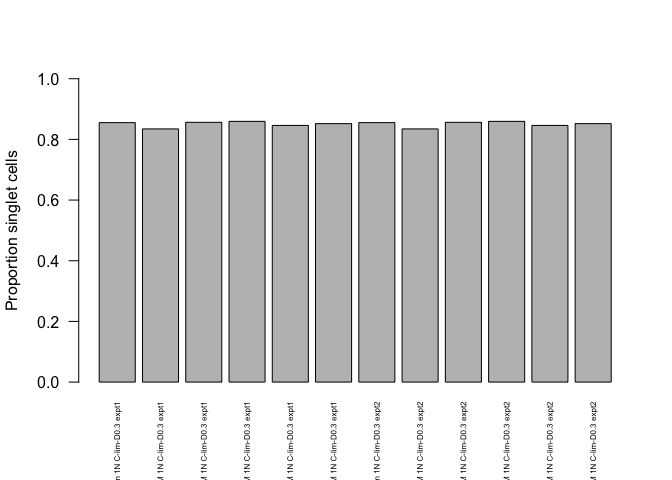<!-- -->

```r
#apply debris gate
filteredData <- Subset(flowData.singlets, pg.nondebris) 
fsApply(filteredData, each_col, length)[1:samples.num]
```

```
##  [1] 42204 41196 42282 42112 41538 41535 42204 41196 42282 42112 41538
## [12] 41535
```

```r
non.debris <- fsApply(filteredData, each_col, length)[1:samples.num]
barplot(non.debris/total, ylim=c(0,1), ylab = "Proportion singlet and nondebris cells", las=2, cex.names = 0.5, names.arg=sampleNames(flowData))
```

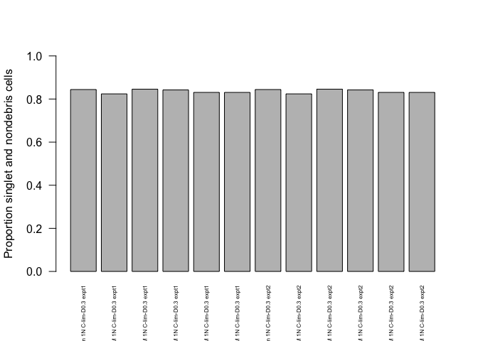<!-- -->

```r
#########
#filteredData is the variable name for the data filtered of doublets and debris that are used for all subsequent analyses
##########

#this gate defines nongfp cells
gfp.neg <- Subset(filteredData, pg.nongfp) 
fsApply(gfp.neg, each_col, length)[1:samples.num]
```

```
##  [1] 41827  7876   133   214    13     7 41827  7876   133   214    13
## [12]     7
```

```r
non.gfp <- fsApply(gfp.neg, each_col, length)[1:samples.num]
barplot(non.gfp/non.debris, ylim=c(0,1), ylab = "Proportion cells with no GFP", las=2, cex.names = 0.5, names.arg=sampleNames(flowData))
```

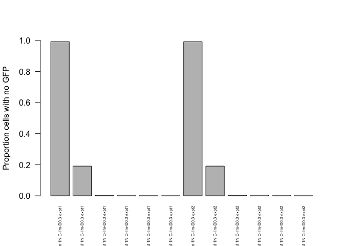<!-- -->

```r
#this gate defines gfp cells
gfp.pos <- Subset(filteredData, pg.gfp) 
fsApply(gfp.pos, each_col, length)[1:samples.num]
```

```
##  [1] 12412 40040 33378 26725 14695  6472 12412 40040 33378 26725 14695
## [12]  6472
```

```r
gfp.cells <- fsApply(gfp.pos, each_col, length)[1:samples.num]
barplot(gfp.cells/non.debris, ylim=c(0,1), ylab = "Proportion cells with GFP", las=2, cex.names = 0.5, names.arg=sampleNames(flowData))
```

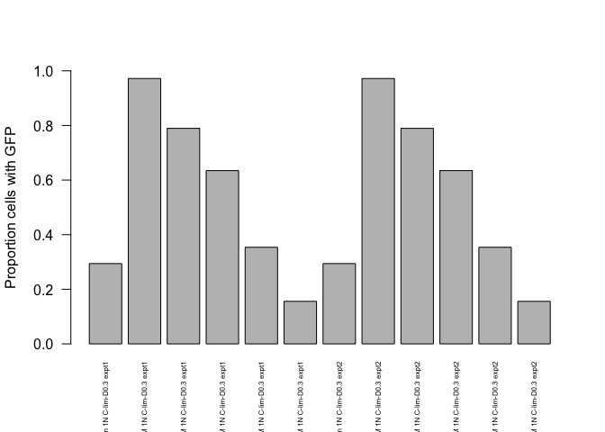<!-- -->

```r
#this gate defines high GFP cells
gfp.hi <- Subset(filteredData, pg.hi.gfp) 
fsApply(gfp.hi, each_col, length)[1:samples.num]
```

```
##  [1]     0  3407 37121 37752 39674 39601     0  3407 37121 37752 39674
## [12] 39601
```

```r
hi.gfp.cells <- fsApply(gfp.hi, each_col, length)[1:samples.num]
barplot(hi.gfp.cells/non.debris, ylim=c(0,1), ylab = "Proportion cells with high GFP", las=2, cex.names = 0.5, names.arg=sampleNames(flowData))
```

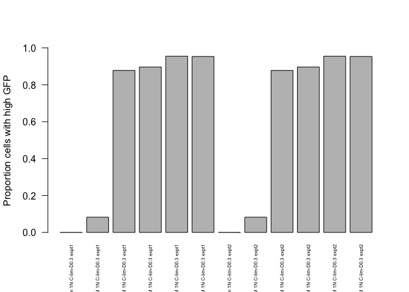<!-- -->

#Step 4: Data analysis

##diagnostic values can be defined for plotting purposes

```r
#define critical values that can superimposed on plots for easy visual comparison

gfp.bg <- 3.9  #a background value for GFP
gfp.wt <- 5.9 #a value for wildtype GFP expression
red.bg <- 3.03 #a background value for the red channel
red.wt <- 3.75 #a value for wildtype Red expression
haploid.fsc <- 6e5 #an empirical value for forward scatter for haploids
diploid.fsc <- 7e5 #an empirical value for forward scatter for diploids
gfp.norm <- 0.935 #an empricial value for gfp expression normalized by forward scatter
red.norm <- 0.57 #an empricial value for red expression normalized by forward scatter
gfp.red.norm <- 1.5 #an empricial value for gfp expression normalized by red channel
```

##Extract data from fcs files to generate statistics and boxplots

```r
#record summary statistics for each sample in a matrix named summary.stats 
summary.stats <- matrix(data = NA, nrow = length(filteredData), ncol = 18, dimnames = list(sampleNames(filteredData),c("FSC_median","FSC_mean", "FSC_sd","FL1_median", "FL1_mean","FL1_sd","normalizedGFP_median", "normalizedGFP_mean", "normalizedGFP_sd","FL2_median","FL2_mean","FL2_sd","normalizedRed_median","normalizedRed_mean", "normalizedRed_sd","GFPnormalizedByRed_median", "GFPnormalizedByRed_mean","GFPnormalizedByRed_sd")))

#use the sample containing the minimum number of points after filtering for doublets and debris to define the number of data points retained for all samples
sample.size <- min(fsApply(filteredData, each_col, length))  

print(sample.size)
```

```
## [1] 41196
```

```r
comparison.FSC <- matrix(data = NA, nrow = sample.size, ncol = length(filteredData), byrow = FALSE,dimnames = NULL)
comparison.FL1 <- matrix(data = NA, nrow = sample.size, ncol = length(filteredData), byrow = FALSE,dimnames = NULL)
comparison.FL2 <- matrix(data = NA, nrow = sample.size, ncol = length(filteredData), byrow = FALSE,dimnames = NULL)
comparison.FL1NormFsc <- matrix(data = NA, nrow = sample.size, ncol = length(filteredData), byrow = FALSE,dimnames = NULL)
comparison.FL2NormFsc <- matrix(data = NA, nrow = sample.size, ncol = length(filteredData), byrow = FALSE,dimnames = NULL)
comparison.FL1NormFL2 <- matrix(data = NA, nrow = sample.size, ncol = length(filteredData), byrow = FALSE,dimnames = NULL)

#for each sample plot a histogram of the normalized data, raw FSC and raw GFP per row
par(mfrow=c(1,2), mar=c(5.1,2.1,2.1,2.1), oma=c(1.5,2,1,1))

#extract data from flowFrames to plot histograms of values and record summary statistics
for (i in 1:length(filteredData)){
 
  temp <- exprs(filteredData[[i]]) #exprs() extracts a matrix of the values from the flowframe
 

  ##########################################
  #record summary statistics for the sample#
  ##########################################
  
  #FSC
  summary.stats[i,1] <- median(temp[,1]) 
  summary.stats[i,2] <-mean(temp[,1])  
  summary.stats[i,3] <- sd(temp[,1])
  #FL1
  summary.stats[i,4] <- median(temp[,3])
  summary.stats[i,5] <-mean(temp[,3])  
  summary.stats[i,6] <- sd(temp[,3])
  #FL1 (GFP) divided by FSC
  summary.stats[i,7] <- median(temp[,3]/temp[,1])
  summary.stats[i,8] <-mean(temp[,3]/temp[,1])  
  summary.stats[i,9] <- sd(temp[,3]/temp[,1])
  #FL2
  summary.stats[i,10] <- median(temp[,4])
  summary.stats[i,11] <-mean(temp[,4])  
  summary.stats[i,12] <- sd(temp[,4])
  #FL2 (Red) divided by FSC
  summary.stats[i,13] <- median(temp[,4]/temp[,1])
  summary.stats[i,14] <-mean(temp[,4]/temp[,1])  
  summary.stats[i,15] <- sd(temp[,4]/temp[,1])
  #FL1 (GFP) divided by FL2 (Red)
  summary.stats[i,16] <- median(temp[,3]/temp[,4])
  summary.stats[i,17] <-mean(temp[,3]/temp[,4])  
  summary.stats[i,18] <- sd(temp[,3]/temp[,4])  
  
  ##############################################
  #plot histograms of the channels of interest##
  ##############################################

  ###############
  #Green channel#
  ###############
  
  #FL1 (GFP)
  hist(log10(temp[,3]), br=1000, xlab = "log10(FL1)", main = "FL1") 
  abline(v=gfp.bg, col="yellow", lty=2, lwd=2)
  abline(v=gfp.wt, col="green", lty=2, lwd=2) 
  legend("topleft",  legend=paste("median FL1 = ",round(median(temp[,3]), digits=4),sep=""))

  #GFP divided by FSC
  hist(temp[,3]/temp[,1], br=500, xlab = "FL1/FSC", main = "FL1/FSC") 
  abline(v=gfp.norm, col="green", lty=2, lwd=2 )
  legend("topleft",  legend=paste("median GFP / FSC=",round(median(temp[,3]/temp[,1]), digits=4),sep=""))
  
  mtext(sampleNames(filteredData[i]), outer = TRUE, cex = 1.0)
  
  ###############
  #Red channel#
  ###############
  #FL2 (Red)
  hist(log10(temp[,4]), br=500, xlab = "log10(FL2)", main = "FL2") 
  abline(v=red.bg, col="yellow", lty=2, lwd=2)
  abline(v=red.wt, col="red", lty=2, lwd=2) 
  legend("topleft",  legend=paste("median FL2=",round(median(temp[,4]), digits=4),sep=""))
 
  #FL2 divided by FSC
  hist(temp[,4]/temp[,1], br=500, xlab = "FL2/FSC", main = "FL2/FSC") 
  abline(v=red.norm, col="red", lty=2, lwd=2 )
  legend("topleft",  legend=paste("median FL2 / FSC=",round(median(temp[,4]/temp[,1]), digits=4),sep=""))

  mtext(sampleNames(filteredData[i]), outer = TRUE, cex = 1.0)
  
  ###############
  #Other#########
  ###############
  
  #FL1 divided by FL2
  hist(temp[,4]/temp[,3], br=500, xlab = "FL2/FL1", main = "FL1/FL2") 
  abline(v=gfp.red.norm, col="purple", lty=2, lwd=2)
  legend("topleft",  legend=paste("median FL1 / FL2=",round(median(temp[,4]/temp[,3]), digits=4),sep=""))

    #FSC
  hist(log10(temp[,1]), br=500, xlab = "log10(FSC)", main = "FSC", xlim=c(4,8)) 
  abline(v=haploid.fsc, col="blue", lty=2, lwd=2)
  abline(v=diploid.fsc, col="grey", lty=2, lwd=2)
  legend("topleft",  legend=paste("median FSC=",round(median(temp[,1]), digits=4),sep=""))
  
  mtext(sampleNames(filteredData[i]), outer = TRUE, cex = 1.0)

print("-------------------------------------------------------")
print("-----------------------------------")
print("----------------------")

  ############################################################
  #keep the data set for generating boxplots comparing values#
  ############################################################
  
  #Note that the amount of data kept for each sample is defined by the lowest count among all the samples.
  comparison.FSC[1:sample.size,i] <- temp[1:sample.size,1] #FSC
  comparison.FL1[1:sample.size,i] <- temp[1:sample.size,3] #FL1 (GFP)
  comparison.FL1NormFsc[1:sample.size,i] <- temp[1:sample.size,3]/temp[1:sample.size,1] #GFP/FSC
  comparison.FL2[1:sample.size,i] <- temp[1:sample.size,4] #FL2 
  comparison.FL2NormFsc[1:sample.size,i] <- temp[1:sample.size,4]/temp[1:sample.size,1] #FL2/FSC
  comparison.FL1NormFL2[1:sample.size,i] <- temp[1:sample.size,3]/temp[1:sample.size,4] #FL1/FL2
  
}
```

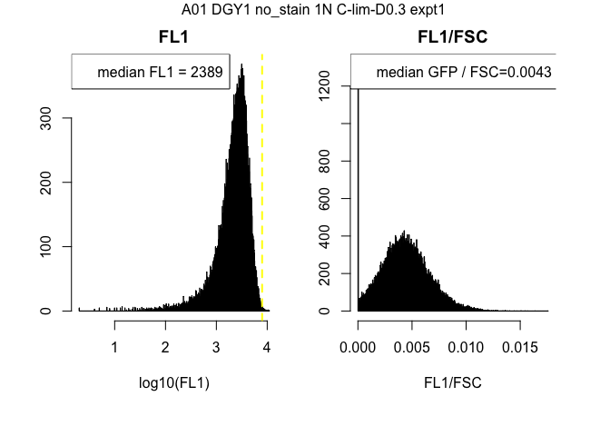<!-- -->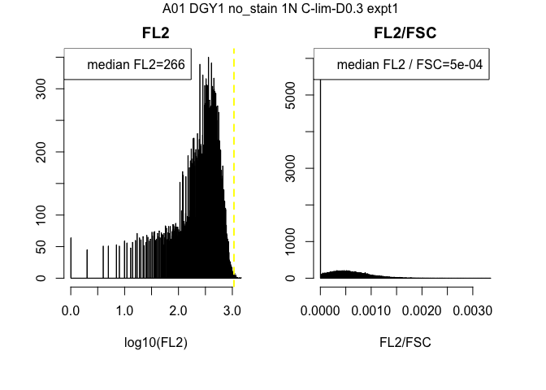<!-- -->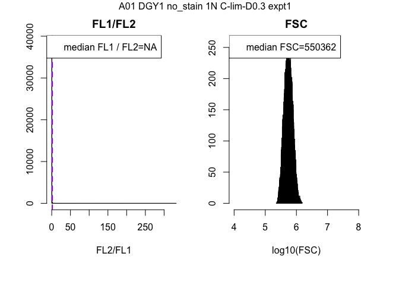<!-- -->

```
## [1] "-------------------------------------------------------"
## [1] "-----------------------------------"
## [1] "----------------------"
```

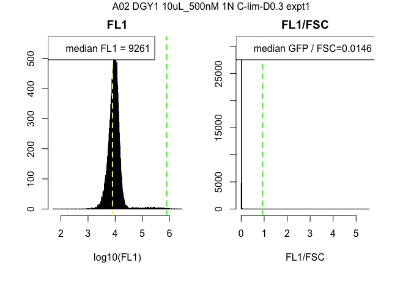<!-- -->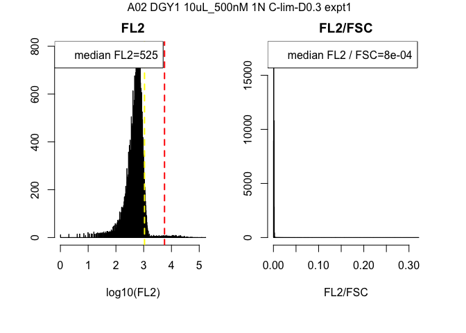<!-- -->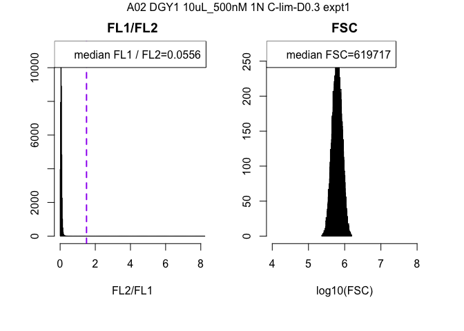<!-- -->

```
## [1] "-------------------------------------------------------"
## [1] "-----------------------------------"
## [1] "----------------------"
```

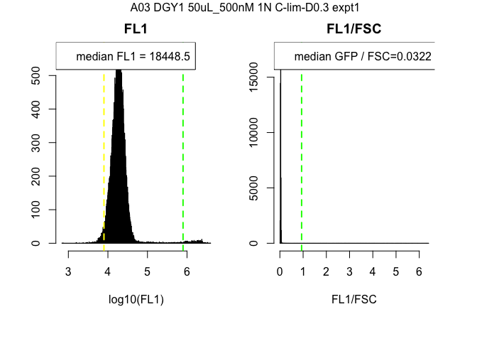<!-- -->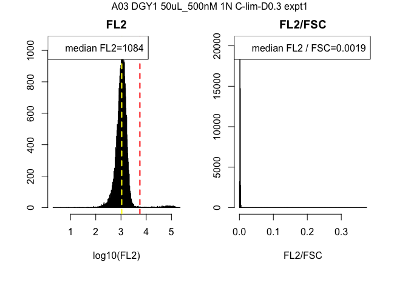<!-- --><!-- -->

```
## [1] "-------------------------------------------------------"
## [1] "-----------------------------------"
## [1] "----------------------"
```

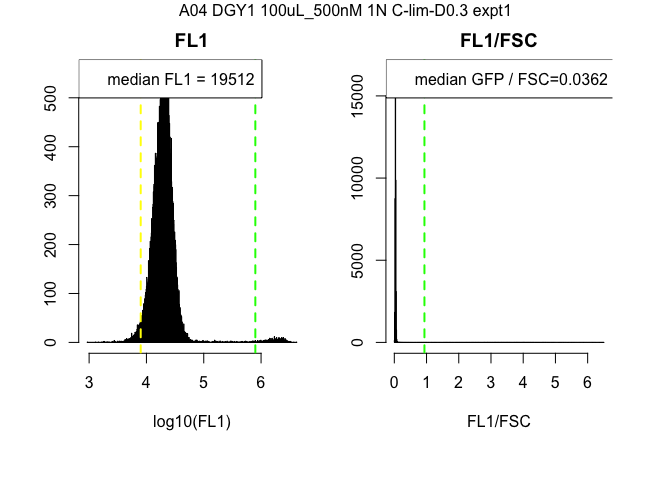<!-- -->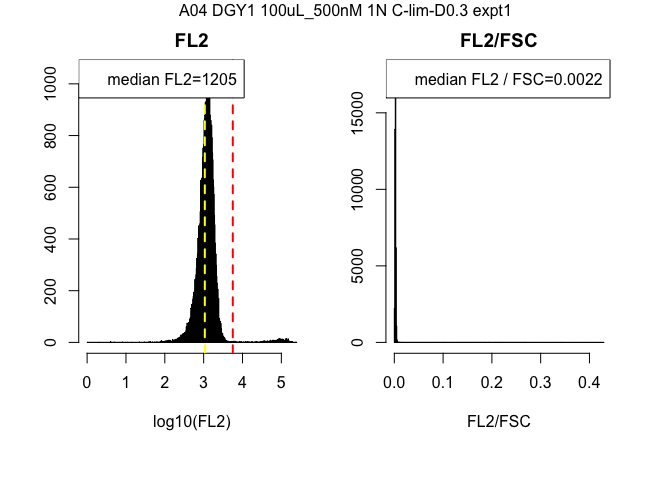<!-- --><!-- -->

```
## [1] "-------------------------------------------------------"
## [1] "-----------------------------------"
## [1] "----------------------"
```

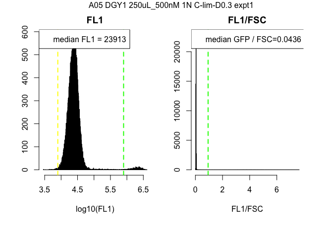<!-- --><!-- -->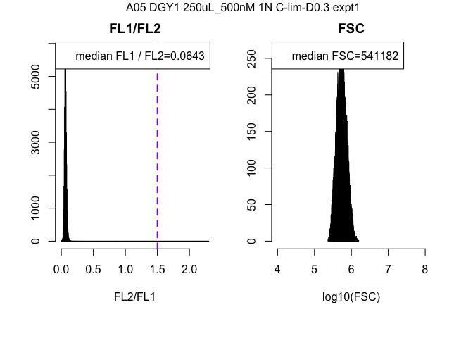<!-- -->

```
## [1] "-------------------------------------------------------"
## [1] "-----------------------------------"
## [1] "----------------------"
```

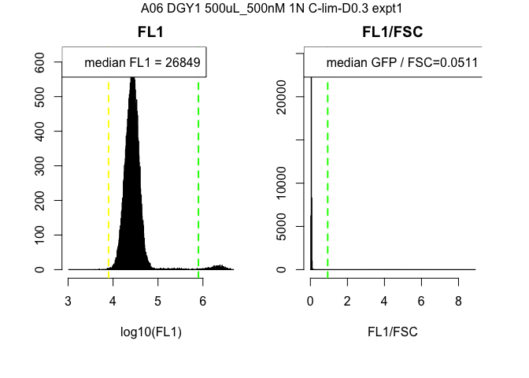<!-- -->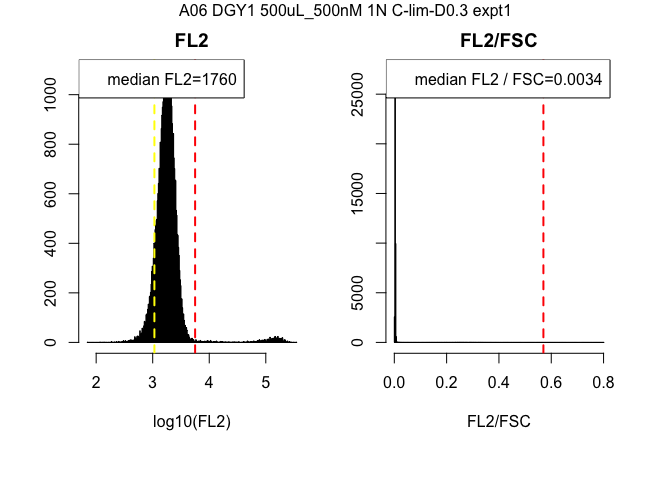<!-- -->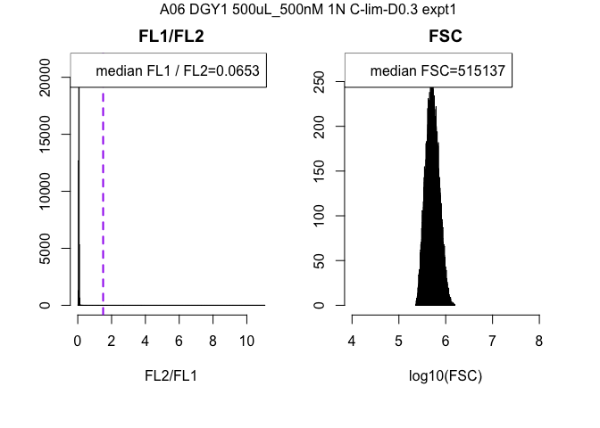<!-- -->

```
## [1] "-------------------------------------------------------"
## [1] "-----------------------------------"
## [1] "----------------------"
```

<!-- --><!-- --><!-- -->

```
## [1] "-------------------------------------------------------"
## [1] "-----------------------------------"
## [1] "----------------------"
```

<!-- -->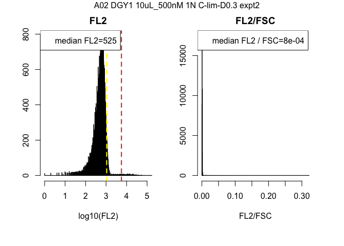<!-- -->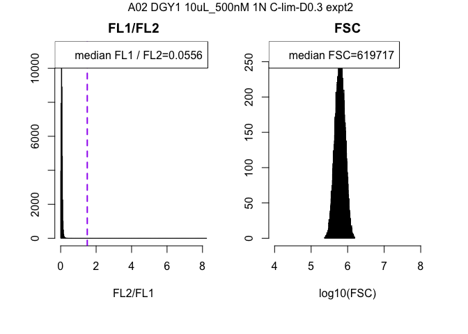<!-- -->

```
## [1] "-------------------------------------------------------"
## [1] "-----------------------------------"
## [1] "----------------------"
```

<!-- --><!-- -->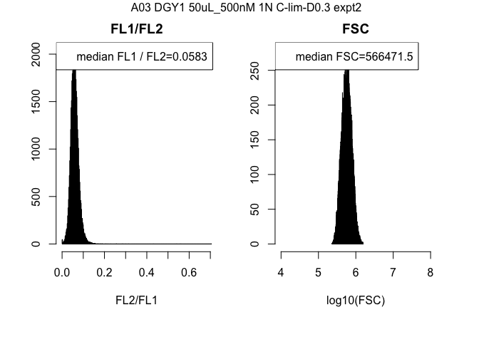<!-- -->

```
## [1] "-------------------------------------------------------"
## [1] "-----------------------------------"
## [1] "----------------------"
```

<!-- -->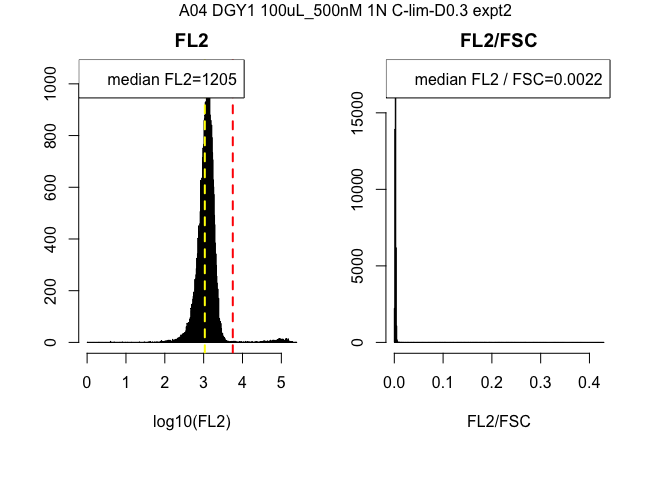<!-- -->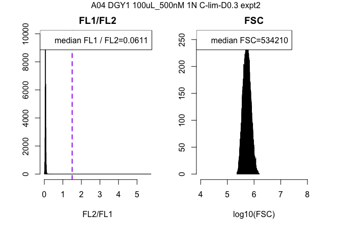<!-- -->

```
## [1] "-------------------------------------------------------"
## [1] "-----------------------------------"
## [1] "----------------------"
```

<!-- -->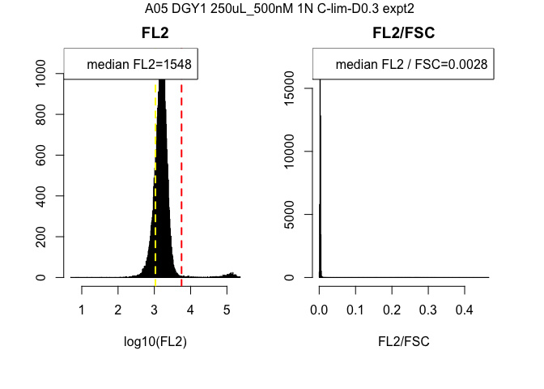<!-- -->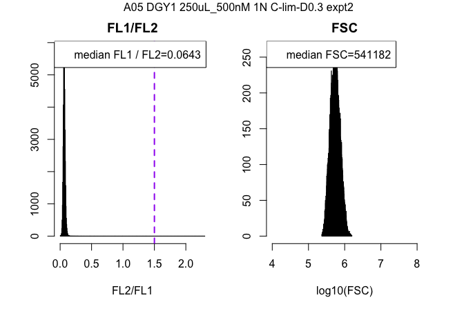<!-- -->

```
## [1] "-------------------------------------------------------"
## [1] "-----------------------------------"
## [1] "----------------------"
```

<!-- -->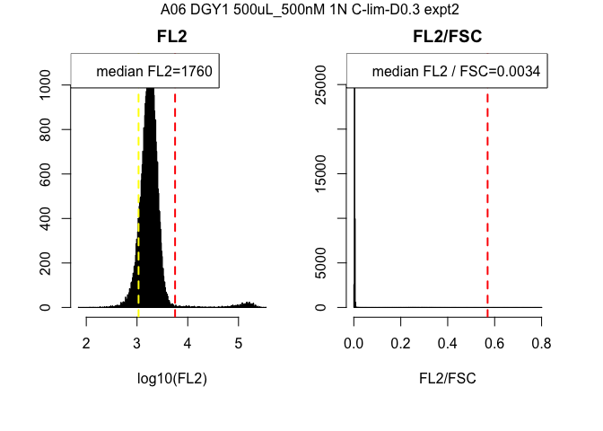<!-- -->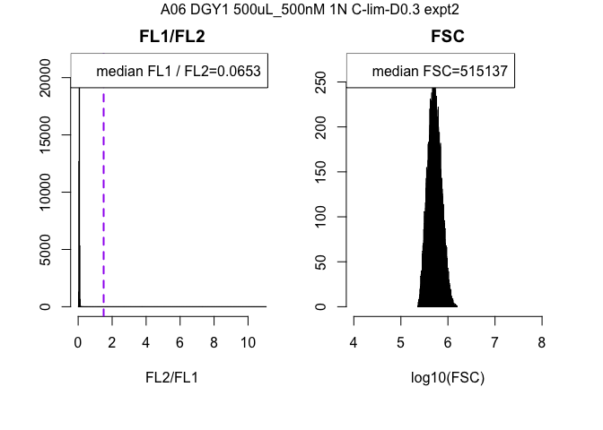<!-- -->

```
## [1] "-------------------------------------------------------"
## [1] "-----------------------------------"
## [1] "----------------------"
```

```r
par(mfrow=c(1,1)) #change number of plots per row back to standard
```


##Overview of data distributions

```r
par(mar=c(8.1,4.1,4.1,2.1)) #create more space at lower margin

boxplot(comparison.FSC, names=sampleNames(filteredData), notch = TRUE, col = "gray", ylab="FSC", cex.axis=0.5,las=2, outline=F)
abline(h=haploid.fsc, lty=2, col=2)
abline(h=diploid.fsc, lty=2, col=3)
```

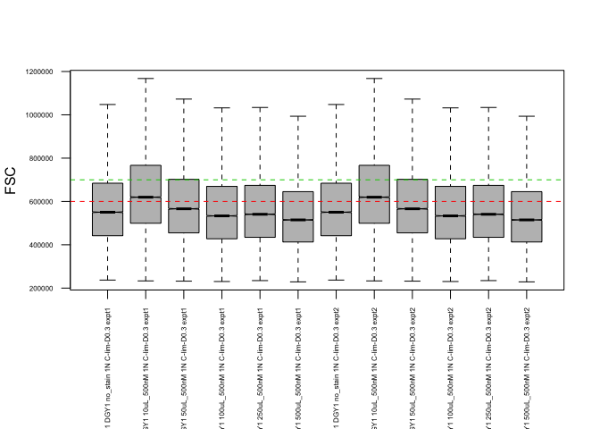<!-- -->

```r
boxplot(comparison.FL1, names=sampleNames(filteredData), notch = TRUE, col = "lightgreen", ylab="FL1", cex.axis=0.5,las=2, outline=F)
abline(h=gfp.bg ,lty=2, lwd=3, col="yellow")
abline(h=gfp.wt, lty = 2, lwd=3, col="green")
```

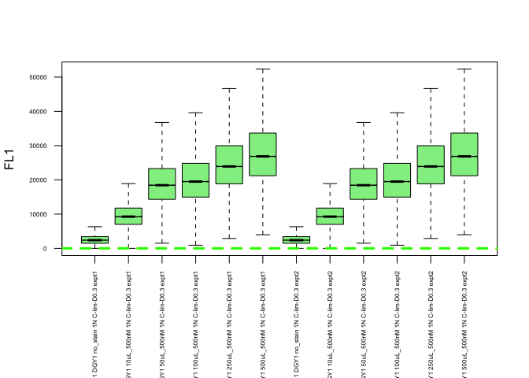<!-- -->

```r
boxplot(comparison.FL1NormFsc, names=sampleNames(filteredData), notch = TRUE, col = "green", ylab="FL1/FSC", cex.axis=0.5,las=2, outline=F)
abline(h=gfp.norm, lty=2, lwd=3, col="blue")
```

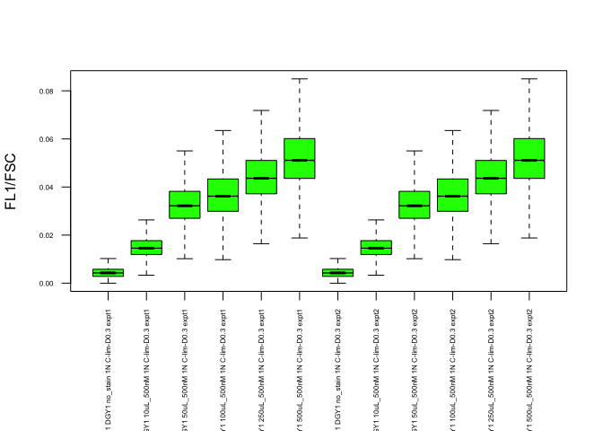<!-- -->

```r
boxplot(comparison.FL2, names=sampleNames(filteredData), notch = TRUE, col = "pink", ylab="FL2", cex.axis=0.5,las=2, outline=F)
abline(h=red.bg, lty=2, lwd=3, col="pink")
abline(h=red.wt, lty=2, lwd=3, col="red")
```

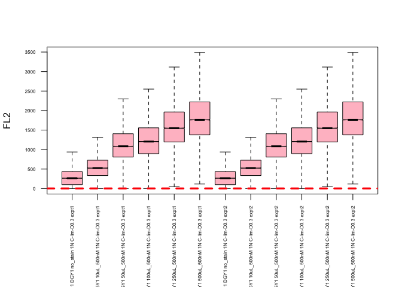<!-- -->

```r
boxplot(comparison.FL2NormFsc, names=sampleNames(filteredData), notch = TRUE, col = "red", ylab="FL2/FSC", cex.axis=0.5,las=2, outline=F)
abline(h=red.norm, lty=2, lwd=3, col="red")
```

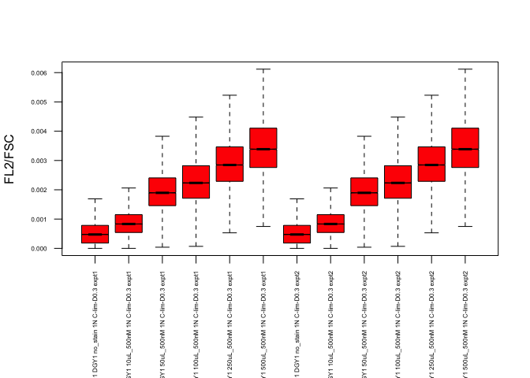<!-- -->

```r
boxplot(comparison.FL1NormFL2, names=sampleNames(filteredData), notch = TRUE, col = "purple", ylab="FL1/FL2", cex.axis=0.5,las=2, outline=F)
abline(h=gfp.red.norm, lty=2, lwd=3, col="purple")
```

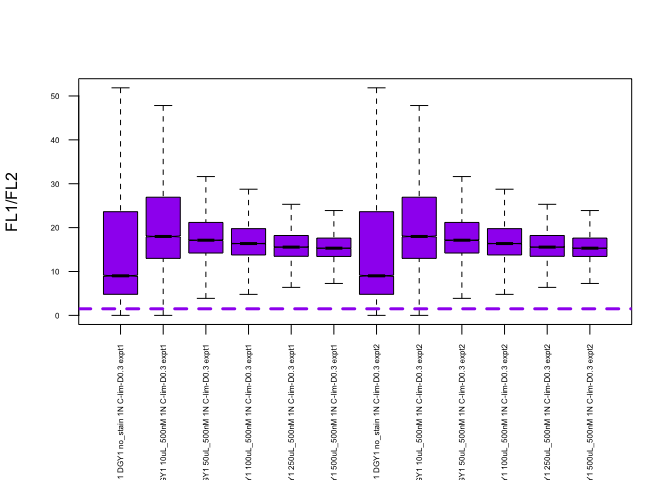<!-- -->

```r
par(mar=c(5.1,4.1,4.1,2.1)) #reset margins to default

#generate a summary table containing all the recorded statistics
print(summary.stats)
```

```
##                                          FSC_median FSC_mean   FSC_sd
## A01 DGY1 no_stain 1N C-lim-D0.3 expt1      550362.0 578443.4 182901.5
## A02 DGY1 10uL_500nM 1N C-lim-D0.3 expt1    619717.0 646434.3 196374.5
## A03 DGY1 50uL_500nM 1N C-lim-D0.3 expt1    566471.5 594382.6 186745.5
## A04 DGY1 100uL_500nM 1N C-lim-D0.3 expt1   534210.0 565948.5 185732.2
## A05 DGY1 250uL_500nM 1N C-lim-D0.3 expt1   541182.0 570647.5 182383.9
## A06 DGY1 500uL_500nM 1N C-lim-D0.3 expt1   515137.0 545937.4 179056.6
## A01 DGY1 no_stain 1N C-lim-D0.3 expt2      550362.0 578443.4 182901.5
## A02 DGY1 10uL_500nM 1N C-lim-D0.3 expt2    619717.0 646434.3 196374.5
## A03 DGY1 50uL_500nM 1N C-lim-D0.3 expt2    566471.5 594382.6 186745.5
## A04 DGY1 100uL_500nM 1N C-lim-D0.3 expt2   534210.0 565948.5 185732.2
## A05 DGY1 250uL_500nM 1N C-lim-D0.3 expt2   541182.0 570647.5 182383.9
## A06 DGY1 500uL_500nM 1N C-lim-D0.3 expt2   515137.0 545937.4 179056.6
##                                          FL1_median  FL1_mean     FL1_sd
## A01 DGY1 no_stain 1N C-lim-D0.3 expt1        2389.0  2505.798   1432.759
## A02 DGY1 10uL_500nM 1N C-lim-D0.3 expt1      9261.0 13525.881  49008.480
## A03 DGY1 50uL_500nM 1N C-lim-D0.3 expt1     18448.5 39403.262 186594.043
## A04 DGY1 100uL_500nM 1N C-lim-D0.3 expt1    19512.0 43152.557 206930.543
## A05 DGY1 250uL_500nM 1N C-lim-D0.3 expt1    23913.0 55436.518 253074.807
## A06 DGY1 500uL_500nM 1N C-lim-D0.3 expt1    26849.0 63747.223 285618.143
## A01 DGY1 no_stain 1N C-lim-D0.3 expt2        2389.0  2505.798   1432.759
## A02 DGY1 10uL_500nM 1N C-lim-D0.3 expt2      9261.0 13525.881  49008.480
## A03 DGY1 50uL_500nM 1N C-lim-D0.3 expt2     18448.5 39403.262 186594.043
## A04 DGY1 100uL_500nM 1N C-lim-D0.3 expt2    19512.0 43152.557 206930.543
## A05 DGY1 250uL_500nM 1N C-lim-D0.3 expt2    23913.0 55436.518 253074.807
## A06 DGY1 500uL_500nM 1N C-lim-D0.3 expt2    26849.0 63747.223 285618.143
##                                          normalizedGFP_median
## A01 DGY1 no_stain 1N C-lim-D0.3 expt1             0.004273229
## A02 DGY1 10uL_500nM 1N C-lim-D0.3 expt1           0.014567241
## A03 DGY1 50uL_500nM 1N C-lim-D0.3 expt1           0.032165375
## A04 DGY1 100uL_500nM 1N C-lim-D0.3 expt1          0.036165830
## A05 DGY1 250uL_500nM 1N C-lim-D0.3 expt1          0.043614604
## A06 DGY1 500uL_500nM 1N C-lim-D0.3 expt1          0.051061943
## A01 DGY1 no_stain 1N C-lim-D0.3 expt2             0.004273229
## A02 DGY1 10uL_500nM 1N C-lim-D0.3 expt2           0.014567241
## A03 DGY1 50uL_500nM 1N C-lim-D0.3 expt2           0.032165375
## A04 DGY1 100uL_500nM 1N C-lim-D0.3 expt2          0.036165830
## A05 DGY1 250uL_500nM 1N C-lim-D0.3 expt2          0.043614604
## A06 DGY1 500uL_500nM 1N C-lim-D0.3 expt2          0.051061943
##                                          normalizedGFP_mean
## A01 DGY1 no_stain 1N C-lim-D0.3 expt1           0.004358658
## A02 DGY1 10uL_500nM 1N C-lim-D0.3 expt1         0.022134494
## A03 DGY1 50uL_500nM 1N C-lim-D0.3 expt1         0.069675151
## A04 DGY1 100uL_500nM 1N C-lim-D0.3 expt1        0.079291972
## A05 DGY1 250uL_500nM 1N C-lim-D0.3 expt1        0.101594779
## A06 DGY1 500uL_500nM 1N C-lim-D0.3 expt1        0.121021319
## A01 DGY1 no_stain 1N C-lim-D0.3 expt2           0.004358658
## A02 DGY1 10uL_500nM 1N C-lim-D0.3 expt2         0.022134494
## A03 DGY1 50uL_500nM 1N C-lim-D0.3 expt2         0.069675151
## A04 DGY1 100uL_500nM 1N C-lim-D0.3 expt2        0.079291972
## A05 DGY1 250uL_500nM 1N C-lim-D0.3 expt2        0.101594779
## A06 DGY1 500uL_500nM 1N C-lim-D0.3 expt2        0.121021319
##                                          normalizedGFP_sd FL2_median
## A01 DGY1 no_stain 1N C-lim-D0.3 expt1         0.002265344        266
## A02 DGY1 10uL_500nM 1N C-lim-D0.3 expt1       0.093144413        525
## A03 DGY1 50uL_500nM 1N C-lim-D0.3 expt1       0.337765302       1084
## A04 DGY1 100uL_500nM 1N C-lim-D0.3 expt1      0.379927453       1205
## A05 DGY1 250uL_500nM 1N C-lim-D0.3 expt1      0.462591869       1548
## A06 DGY1 500uL_500nM 1N C-lim-D0.3 expt1      0.535092454       1760
## A01 DGY1 no_stain 1N C-lim-D0.3 expt2         0.002265344        266
## A02 DGY1 10uL_500nM 1N C-lim-D0.3 expt2       0.093144413        525
## A03 DGY1 50uL_500nM 1N C-lim-D0.3 expt2       0.337765302       1084
## A04 DGY1 100uL_500nM 1N C-lim-D0.3 expt2      0.379927453       1205
## A05 DGY1 250uL_500nM 1N C-lim-D0.3 expt2      0.462591869       1548
## A06 DGY1 500uL_500nM 1N C-lim-D0.3 expt2      0.535092454       1760
##                                           FL2_mean     FL2_sd
## A01 DGY1 no_stain 1N C-lim-D0.3 expt1     286.1407   219.7696
## A02 DGY1 10uL_500nM 1N C-lim-D0.3 expt1   697.4944  2189.1242
## A03 DGY1 50uL_500nM 1N C-lim-D0.3 expt1  2113.9327  9459.2402
## A04 DGY1 100uL_500nM 1N C-lim-D0.3 expt1 2467.8085 11441.0674
## A05 DGY1 250uL_500nM 1N C-lim-D0.3 expt1 3389.7610 15059.6897
## A06 DGY1 500uL_500nM 1N C-lim-D0.3 expt1 4121.0068 18461.7822
## A01 DGY1 no_stain 1N C-lim-D0.3 expt2     286.1407   219.7696
## A02 DGY1 10uL_500nM 1N C-lim-D0.3 expt2   697.4944  2189.1242
## A03 DGY1 50uL_500nM 1N C-lim-D0.3 expt2  2113.9327  9459.2402
## A04 DGY1 100uL_500nM 1N C-lim-D0.3 expt2 2467.8085 11441.0674
## A05 DGY1 250uL_500nM 1N C-lim-D0.3 expt2 3389.7610 15059.6897
## A06 DGY1 500uL_500nM 1N C-lim-D0.3 expt2 4121.0068 18461.7822
##                                          normalizedRed_median
## A01 DGY1 no_stain 1N C-lim-D0.3 expt1            0.0004734632
## A02 DGY1 10uL_500nM 1N C-lim-D0.3 expt1          0.0008324645
## A03 DGY1 50uL_500nM 1N C-lim-D0.3 expt1          0.0018947655
## A04 DGY1 100uL_500nM 1N C-lim-D0.3 expt1         0.0022309944
## A05 DGY1 250uL_500nM 1N C-lim-D0.3 expt1         0.0028458199
## A06 DGY1 500uL_500nM 1N C-lim-D0.3 expt1         0.0033833915
## A01 DGY1 no_stain 1N C-lim-D0.3 expt2            0.0004734632
## A02 DGY1 10uL_500nM 1N C-lim-D0.3 expt2          0.0008324645
## A03 DGY1 50uL_500nM 1N C-lim-D0.3 expt2          0.0018947655
## A04 DGY1 100uL_500nM 1N C-lim-D0.3 expt2         0.0022309944
## A05 DGY1 250uL_500nM 1N C-lim-D0.3 expt2         0.0028458199
## A06 DGY1 500uL_500nM 1N C-lim-D0.3 expt2         0.0033833915
##                                          normalizedRed_mean
## A01 DGY1 no_stain 1N C-lim-D0.3 expt1          0.0005225371
## A02 DGY1 10uL_500nM 1N C-lim-D0.3 expt1        0.0011504355
## A03 DGY1 50uL_500nM 1N C-lim-D0.3 expt1        0.0037717334
## A04 DGY1 100uL_500nM 1N C-lim-D0.3 expt1       0.0045655837
## A05 DGY1 250uL_500nM 1N C-lim-D0.3 expt1       0.0062481366
## A06 DGY1 500uL_500nM 1N C-lim-D0.3 expt1       0.0078667444
## A01 DGY1 no_stain 1N C-lim-D0.3 expt2          0.0005225371
## A02 DGY1 10uL_500nM 1N C-lim-D0.3 expt2        0.0011504355
## A03 DGY1 50uL_500nM 1N C-lim-D0.3 expt2        0.0037717334
## A04 DGY1 100uL_500nM 1N C-lim-D0.3 expt2       0.0045655837
## A05 DGY1 250uL_500nM 1N C-lim-D0.3 expt2       0.0062481366
## A06 DGY1 500uL_500nM 1N C-lim-D0.3 expt2       0.0078667444
##                                          normalizedRed_sd
## A01 DGY1 no_stain 1N C-lim-D0.3 expt1         0.000419210
## A02 DGY1 10uL_500nM 1N C-lim-D0.3 expt1       0.004240531
## A03 DGY1 50uL_500nM 1N C-lim-D0.3 expt1       0.017446809
## A04 DGY1 100uL_500nM 1N C-lim-D0.3 expt1      0.021139278
## A05 DGY1 250uL_500nM 1N C-lim-D0.3 expt1      0.027725480
## A06 DGY1 500uL_500nM 1N C-lim-D0.3 expt1      0.034954035
## A01 DGY1 no_stain 1N C-lim-D0.3 expt2         0.000419210
## A02 DGY1 10uL_500nM 1N C-lim-D0.3 expt2       0.004240531
## A03 DGY1 50uL_500nM 1N C-lim-D0.3 expt2       0.017446809
## A04 DGY1 100uL_500nM 1N C-lim-D0.3 expt2      0.021139278
## A05 DGY1 250uL_500nM 1N C-lim-D0.3 expt2      0.027725480
## A06 DGY1 500uL_500nM 1N C-lim-D0.3 expt2      0.034954035
##                                          GFPnormalizedByRed_median
## A01 DGY1 no_stain 1N C-lim-D0.3 expt1                           NA
## A02 DGY1 10uL_500nM 1N C-lim-D0.3 expt1                   17.98301
## A03 DGY1 50uL_500nM 1N C-lim-D0.3 expt1                   17.13975
## A04 DGY1 100uL_500nM 1N C-lim-D0.3 expt1                  16.36705
## A05 DGY1 250uL_500nM 1N C-lim-D0.3 expt1                  15.55815
## A06 DGY1 500uL_500nM 1N C-lim-D0.3 expt1                  15.31553
## A01 DGY1 no_stain 1N C-lim-D0.3 expt2                           NA
## A02 DGY1 10uL_500nM 1N C-lim-D0.3 expt2                   17.98301
## A03 DGY1 50uL_500nM 1N C-lim-D0.3 expt2                   17.13975
## A04 DGY1 100uL_500nM 1N C-lim-D0.3 expt2                  16.36705
## A05 DGY1 250uL_500nM 1N C-lim-D0.3 expt2                  15.55815
## A06 DGY1 500uL_500nM 1N C-lim-D0.3 expt2                  15.31553
##                                          GFPnormalizedByRed_mean
## A01 DGY1 no_stain 1N C-lim-D0.3 expt1                        NaN
## A02 DGY1 10uL_500nM 1N C-lim-D0.3 expt1                      Inf
## A03 DGY1 50uL_500nM 1N C-lim-D0.3 expt1                      Inf
## A04 DGY1 100uL_500nM 1N C-lim-D0.3 expt1                     Inf
## A05 DGY1 250uL_500nM 1N C-lim-D0.3 expt1                     Inf
## A06 DGY1 500uL_500nM 1N C-lim-D0.3 expt1                     Inf
## A01 DGY1 no_stain 1N C-lim-D0.3 expt2                        NaN
## A02 DGY1 10uL_500nM 1N C-lim-D0.3 expt2                      Inf
## A03 DGY1 50uL_500nM 1N C-lim-D0.3 expt2                      Inf
## A04 DGY1 100uL_500nM 1N C-lim-D0.3 expt2                     Inf
## A05 DGY1 250uL_500nM 1N C-lim-D0.3 expt2                     Inf
## A06 DGY1 500uL_500nM 1N C-lim-D0.3 expt2                     Inf
##                                          GFPnormalizedByRed_sd
## A01 DGY1 no_stain 1N C-lim-D0.3 expt1                       NA
## A02 DGY1 10uL_500nM 1N C-lim-D0.3 expt1                    NaN
## A03 DGY1 50uL_500nM 1N C-lim-D0.3 expt1                    NaN
## A04 DGY1 100uL_500nM 1N C-lim-D0.3 expt1                   NaN
## A05 DGY1 250uL_500nM 1N C-lim-D0.3 expt1                   NaN
## A06 DGY1 500uL_500nM 1N C-lim-D0.3 expt1                   NaN
## A01 DGY1 no_stain 1N C-lim-D0.3 expt2                       NA
## A02 DGY1 10uL_500nM 1N C-lim-D0.3 expt2                    NaN
## A03 DGY1 50uL_500nM 1N C-lim-D0.3 expt2                    NaN
## A04 DGY1 100uL_500nM 1N C-lim-D0.3 expt2                   NaN
## A05 DGY1 250uL_500nM 1N C-lim-D0.3 expt2                   NaN
## A06 DGY1 500uL_500nM 1N C-lim-D0.3 expt2                   NaN
```

```r
summary.stats <- as.data.frame(summary.stats)
```


##Quantitation of relative FL1 signal

```r
baseline.FL1 <- summary.stats$FL1_median[1]

barplot(summary.stats$FL1_median/baseline.FL1, ylab="Relative FL1 median expression", las=2, cex.names = 0.5, names.arg=sampleNames(filteredData))
```

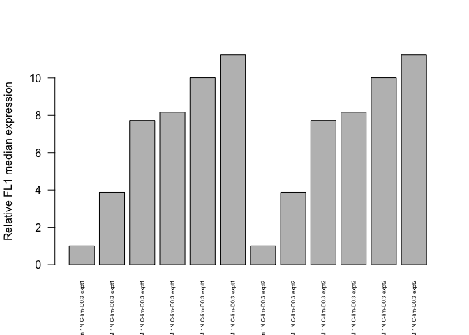<!-- -->

##Quantitation of forward scatter

```r
baseline.FSC <- summary.stats$FSC_median[1]

barplot(summary.stats$FSC_median/baseline.FSC, ylab="Relative median FSC", las=2, cex.names = 0.5, names.arg=sampleNames(filteredData))
```

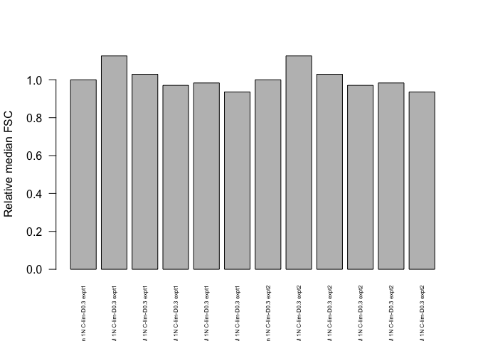<!-- -->

##Population composition

```r
pop.composition <- rbind(non.gfp/non.debris,gfp.cells/non.debris,hi.gfp.cells/non.debris)
barplot(pop.composition, ylab="Proportion of population", legend=c("No GFP", "Normal GFP", "High GFP"),las=2, cex.names = 0.5,names.arg=sampleNames(filteredData))
```

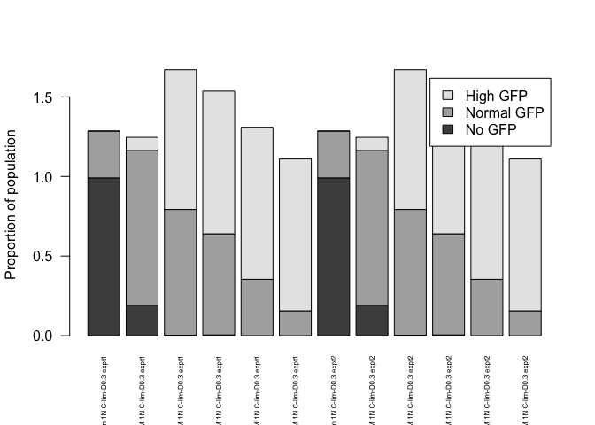<!-- -->

#Step 5: Quality control

##Gates

```r
###First flowset
#Singlets gate
xyplot(FSC.A~FSC.H, data=flowData.1, xlim=c(0,3e6), ylim=c(0,3e6), filter=pg.singlets,  smooth=F, xbin=1024, stat=T, pos=0.5, abs=T, main = "First flowset - singlets gate")
```

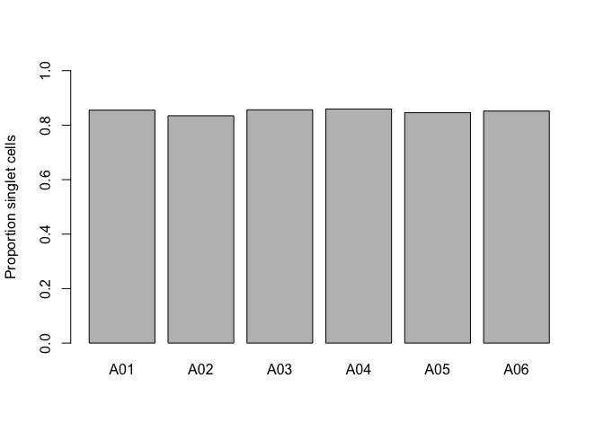<!-- -->

```r
#Debris gate
xyplot(SSC.A ~ FSC.A, data=flowData.1, displayFilter=TRUE, xlim=c(0,3e6), ylim=c(0,3e5), filter=pg.nondebris, smooth=F, xbin=1024, stat=T, pos=0.5, abs=T,  main = "First flowset - nondebris gate")
```

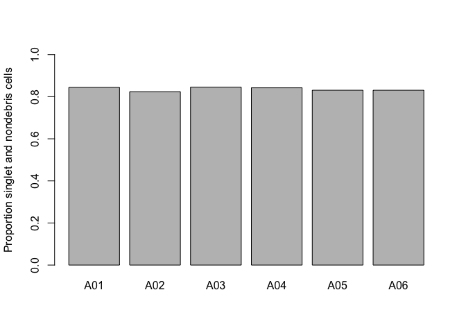<!-- -->

```r
#Non-fluorescent population gate
xyplot(FL1.A~FSC.A,data=flowData.1, displayFilter=TRUE, xlim=c(0,5e6), ylim=c(0,5e4), filter=pg.nongfp, smooth=F, xbin=1024, stat=T, pos=0.5, abs=T,  main = "First flowset - non GFP gate")
```

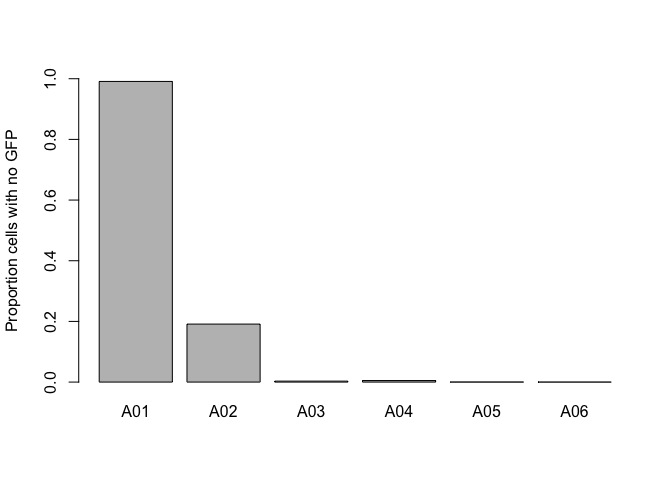<!-- -->

```r
#Fluorescent population gate
xyplot(FL1.A~FSC.A,data=flowData.1, displayFilter=TRUE, xlim=c(0,5e6), ylim=c(0,5e4), filter=pg.gfp, smooth=F, xbin=1024, stat=T, pos=0.5, abs=T, main = "First flowset - GFP gate")
```

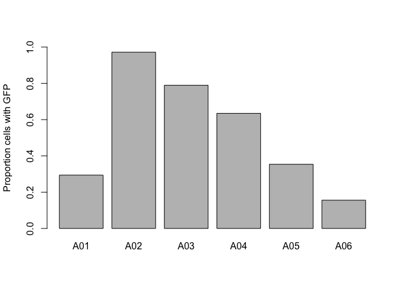<!-- -->

```r
#High fluorescing gate
xyplot(FL1.A~FSC.A,data=flowData.1, xlim=c(0,5e6), ylim=c(0,5e4), filter=pg.hi.gfp, smooth=F, xbin=1024, stat=T, pos=0.5, abs=T,  main = "First flowset - high GFP gate")
```

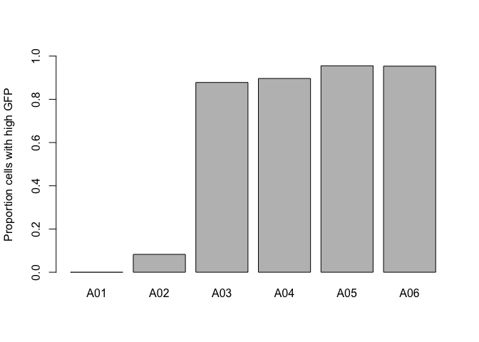<!-- -->

```r
################
###Second flowset
#Singlets gate
xyplot(FSC.A~FSC.H, data=flowData.2, xlim=c(0,3e6), ylim=c(0,3e6), filter=pg.singlets,  smooth=F, xbin=1024, stat=T, pos=0.5, abs=T, main = "Second flowset - singlets gate")
```

<!-- -->

```r
#Debris gate
xyplot(SSC.A ~ FSC.A, data=flowData.2, displayFilter=TRUE, xlim=c(0,3e6), ylim=c(0,3e5), filter=pg.nondebris, smooth=F, xbin=1024, stat=T, pos=0.5, abs=T,  main = "Second flowset  - nondebris gate")
```

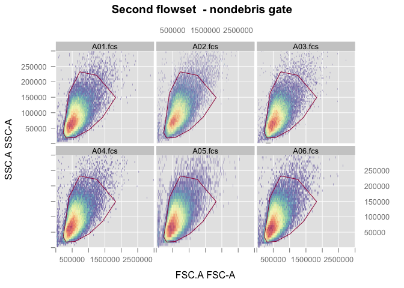<!-- -->

```r
#Non-fluorescent population gate
xyplot(FL1.A~FSC.A,data=flowData.2, displayFilter=TRUE, xlim=c(0,5e6), ylim=c(0,5e4), filter=pg.nongfp, smooth=F, xbin=1024, stat=T, pos=0.5, abs=T,  main = "Second flowset - non GFP gate")
```

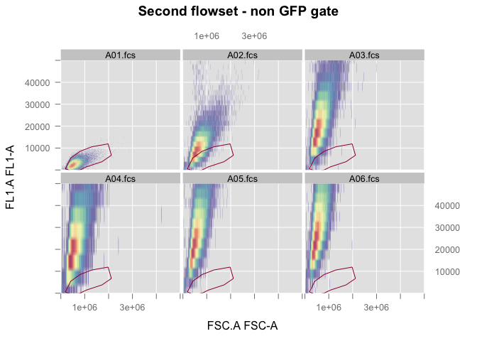<!-- -->

```r
#Fluorescent population gate
xyplot(FL1.A~FSC.A,data=flowData.2, displayFilter=TRUE, xlim=c(0,5e6), ylim=c(0,5e4), filter=pg.gfp, smooth=F, xbin=1024, stat=T, pos=0.5, abs=T, main = "Second flowset - GFP gate")
```

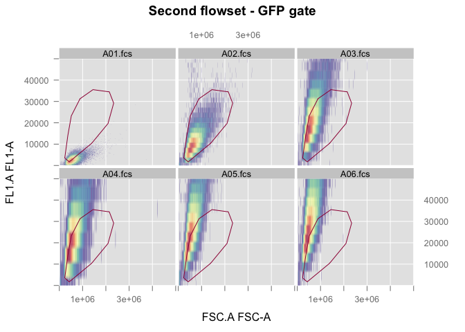<!-- -->

```r
#High fluorescing gate 
xyplot(FL1.A~FSC.A,data=flowData.2, xlim=c(0,5e6), ylim=c(0,5e4), filter=pg.hi.gfp, smooth=F, xbin=1024, stat=T, pos=0.5, abs=T,  main = "Second flowset - high GFP gate")
```

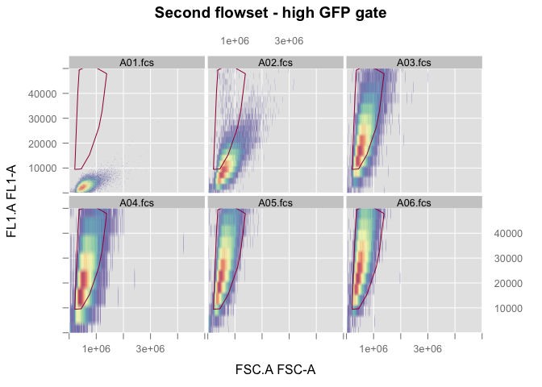<!-- -->

```r
#####Attempted as loop below to plot each one individually and is not working

for (i in 1:length(filteredData)){

#Singlets gate
xyplot(FSC.A~FSC.H, data=flowData[i], xlim=c(0,3e6), ylim=c(0,3e6), filter=pg.singlets,  smooth=F, xbin=1024, stat=T, pos=0.5, abs=T, main = sampleNames(flowData)[i])

#Debris gate
xyplot(SSC.A ~ FSC.A, data=flowData[i], displayFilter=TRUE, xlim=c(0,3e5), ylim=c(0,3e6), filter=pg.nondebris, smooth=F, xbin=1024, stat=T, pos=0.5, abs=T, main = sampleNames(flowData)[i])

#Non-fluorescent population gate
xyplot(FL1.A~FSC.A,data=flowData[i], displayFilter=TRUE, xlim=c(0,5e6), ylim=c(0,5e4), filter=pg.nongfp, smooth=F, xbin=1024, stat=T, pos=0.5, abs=T, main = sampleNames(flowData)[i])

#Fluorescent population gate
xyplot(FL1.A~FSC.A,data=flowData[i], displayFilter=TRUE, xlim=c(0,5e6), ylim=c(0,5e4), filter=pg.gfp, smooth=F, xbin=1024, stat=T, pos=0.5, abs=T, main = sampleNames(flowData)[i])

#High fluorescing gate
xyplot(FL1.A~FSC.A,data=flowData[i], xlim=c(0,5e6), ylim=c(0,5e4), filter=pg.hi.gfp, smooth=F, xbin=1024, stat=T, pos=0.5, abs=T, main = sampleNames(flowData)[i])

}
```


##Data transformation for visualization

```r
#In order to look at QC plots the data is transformed using the logicle transform, which is a log transform for high values that transitions to a linear transformation near zero values 

#This is simply for visualization purposes

lgcl <- logicleTransform(w = 0.5, t= 10000, m=4.5) #the parameters w,t, and m define the transformation parameters

#Dataset 1 tranformation applied to every channel except width and time
dataLGCLTransform <- transform(filteredData,'FSC.A' = lgcl(`FSC.A`), 'SSC.A' =lgcl(`SSC.A`), 'FL1.A' = lgcl(`FL1.A`), 'FL2.A' = lgcl(`FL2.A`), 'FL3.A' = lgcl(`FL3.A`), 'FL4.A' = lgcl(`FL4.A`),'FSC.H' = lgcl(`FSC.H`),'SSC.H' = lgcl(`SSC.H`),'FL1.H' = lgcl(`FL1.H`),'FL2.H' = lgcl(`FL2.H`),'FL3.H' = lgcl(`FL3.H`),'FL4.H' = lgcl(`FL4.H`)) 
```

##Effect of time

```r
#The effect of time on signal (of which there shouldn't be any)
i <- 1
xyplot(FL1.A ~ Time, data=dataLGCLTransform[i], smooth=F,  stat=T, pos=0.5, abs=T, xlim=c(150,250), main = sampleNames(filteredData)[i])
```

<!-- -->

```r
i <- 2
xyplot(FL1.A ~ Time, data=dataLGCLTransform[i], smooth=F,  stat=T, pos=0.5, abs=T, xlim=c(150,250), main = sampleNames(filteredData)[i])
```

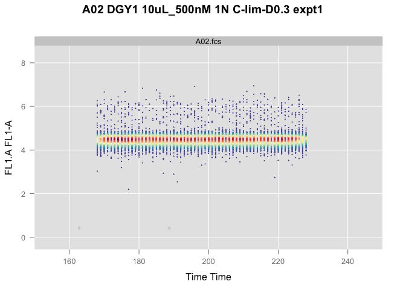<!-- -->

```r
i <- 3
xyplot(FL1.A ~ Time, data=dataLGCLTransform[i], smooth=F,  stat=T, pos=0.5, abs=T, xlim=c(150,250), main = sampleNames(filteredData)[i])
```

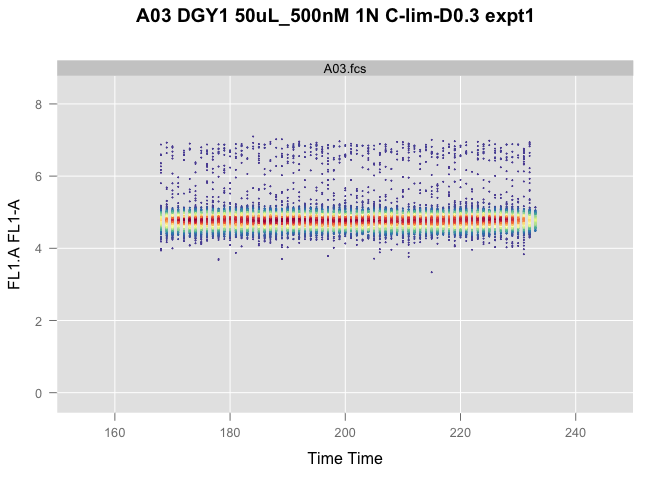<!-- -->

```r
####Attempted as loop and will not work 
for (i in 1:length(filteredData)){
xyplot(FL1.A ~ Time, data=dataLGCLTransform[i], smooth=F,  stat=T, pos=0.5, abs=T, xlim=c(150,250), main = sampleNames(filteredData)[i])
}
```

##Plots of FL1 versus FSC

```r
i <- 1
xyplot(FL1.A ~ FSC.A, data=dataLGCLTransform[i], smooth=F,  stat=T, pos=0.5, abs=T, xlim=c(4,8), sampleNames(filteredData)[i])
```

```
## Warning: 'filter' must either be a filtersList,filterResultList, a single
## filter object or a named list of filter objects.
```

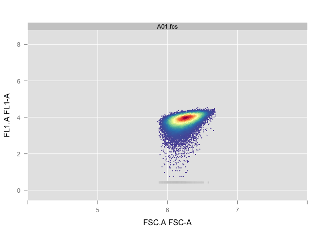<!-- -->

```r
i <- 2
xyplot(FL1.A ~ FSC.A, data=dataLGCLTransform[i], smooth=F,  stat=T, pos=0.5, abs=T, xlim=c(4,8), sampleNames(filteredData)[i])
```

```
## Warning: 'filter' must either be a filtersList,filterResultList, a single
## filter object or a named list of filter objects.
```

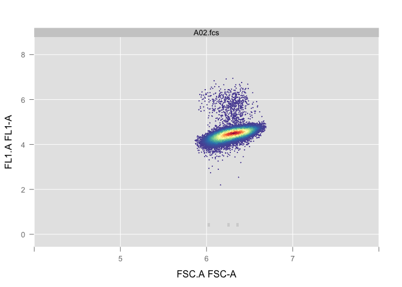<!-- -->

```r
i <- 3
xyplot(FL1.A ~ FSC.A, data=dataLGCLTransform[i], smooth=F,  stat=T, pos=0.5, abs=T, xlim=c(4,8), sampleNames(filteredData)[i])
```

```
## Warning: 'filter' must either be a filtersList,filterResultList, a single
## filter object or a named list of filter objects.
```

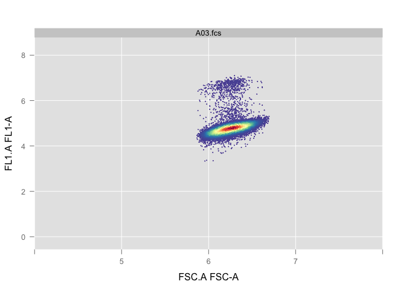<!-- -->

```r
####Attempted as loop and will not work 
for (i in 1:length(filteredData)){
xyplot(FL1.A ~ FSC.A, data=dataLGCLTransform[i], smooth=F,  stat=T, pos=0.5, abs=T, xlim=c(4,8), ylim=c(2,6), sampleNames(filteredData)[i])
}
```

##Plots of FSC versus SSC

```r
i <- 1
xyplot(SSC.A ~ FSC.A, data=dataLGCLTransform[i], smooth=F,  stat=T, pos=0.5, abs=T, xlim=c(4,8), ylim=c(4,8), sampleNames(filteredData)[i])
```

```
## Warning: 'filter' must either be a filtersList,filterResultList, a single
## filter object or a named list of filter objects.
```

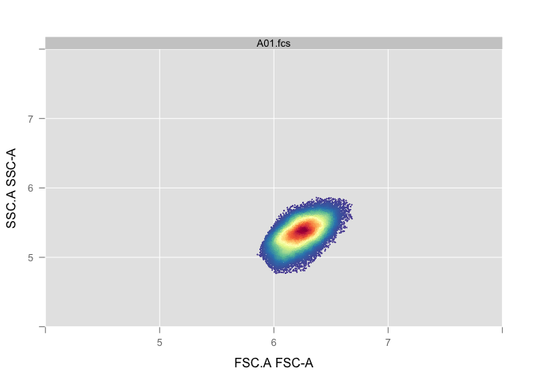<!-- -->

```r
i <- 2
xyplot(SSC.A ~ FSC.A, data=dataLGCLTransform[i], smooth=F,  stat=T, pos=0.5, abs=T, xlim=c(4,8), ylim=c(4,8), sampleNames(filteredData)[i])
```

```
## Warning: 'filter' must either be a filtersList,filterResultList, a single
## filter object or a named list of filter objects.
```

<!-- -->

```r
i <- 3
xyplot(SSC.A ~ FSC.A, data=dataLGCLTransform[i], smooth=F,  stat=T, pos=0.5, abs=T, xlim=c(4,8), ylim=c(4,8), sampleNames(filteredData)[i])
```

```
## Warning: 'filter' must either be a filtersList,filterResultList, a single
## filter object or a named list of filter objects.
```

<!-- -->

```r
####Attempted as loop and will not work 
for (i in 1:length(filteredData)){
xyplot(SSC.A ~ FSC.A, data=dataLGCLTransform[i], smooth=F,  stat=T, pos=0.5, abs=T, xlim=c(4,8), ylim=c(4,8), sampleNames(filteredData)[i])
}
```


